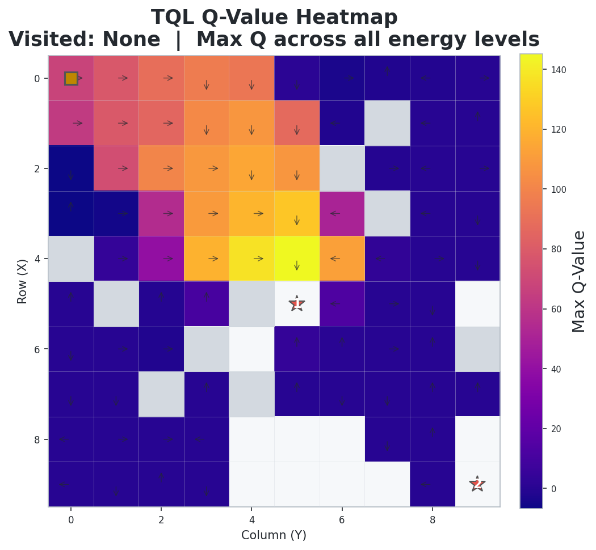
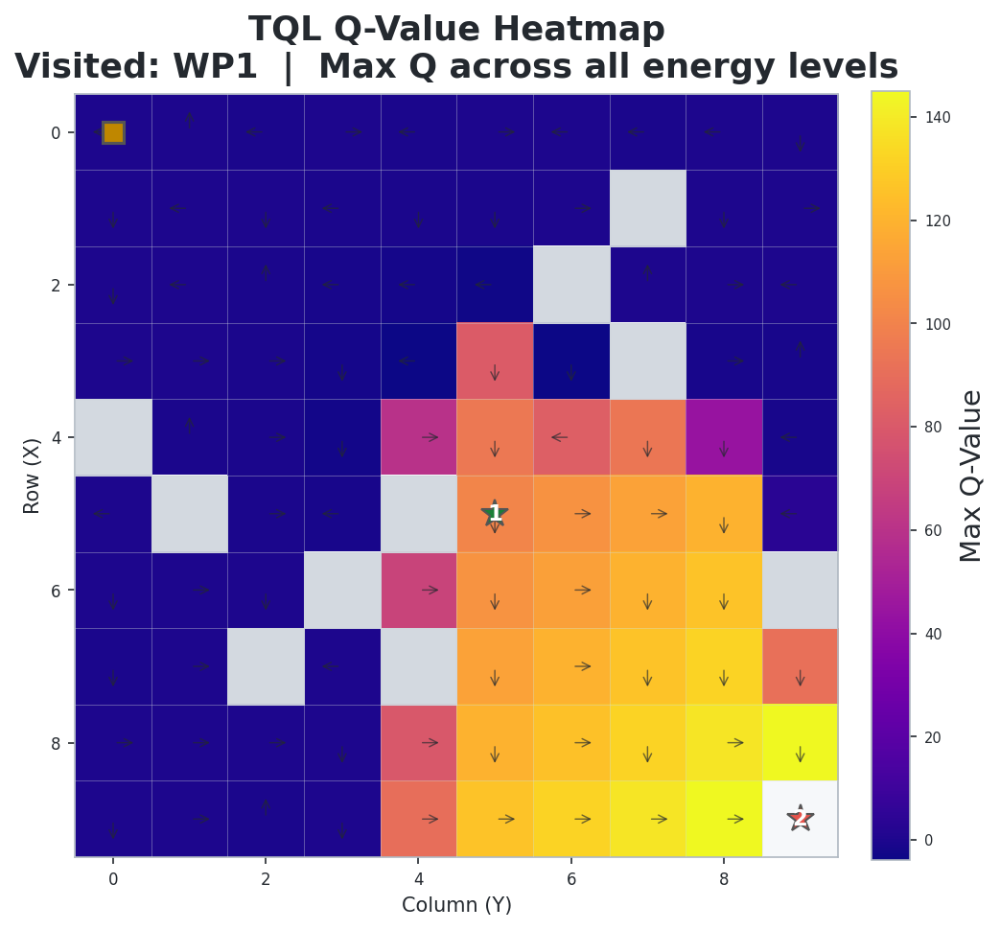

# 1_TQL: Tabular Q-Learning 기반 UAV 경로 최적화

## 개요

- Tabular Q-Learning(TQL)을 사용하여 **2D 그리드 환경에서 UAV가 장애물을 회피하며 웨이포인트를 순서대로 방문**하는 경로 최적화 문제를 해결
- 에너지 제약 조건 하에서 최소 스텝으로 임무를 완료하도록 학습

## 환경 (Environment)

### 상태 공간 (State)

| 요소 | 설명 |
| ------ | ------ |
| `(x, y)` | UAV의 현재 그리드 좌표 |
| `energy` | 잔여 에너지 (이산화) |
| `visited` | 각 웨이포인트 방문 여부 `(False/True, ...)` |

> TQL은 상태를 튜플 `(x, y, energy, visited)` 로 이산화하여 Q-테이블 키로 사용합니다.

### 행동 공간 (Action)

| Action | 방향 |
| :------: | ------ |
| 0 | ↑ 상 |
| 1 | ↓ 하 |
| 2 | ← 좌 |
| 3 | → 우 |

### 환경 설정

| 항목 | 설정값 |
| ------ | -------- |
| 그리드 크기 | 10 × 10 |
| 행동 공간 | 이산 4방향 (상/하/좌/우) |
| 웨이포인트 | 2개 (중간 지점, 끝 지점), **순서대로 방문** |
| 장애물 | 고정 배치, 10개 |
| 에너지 예산 | 최단 맨해튼 경로 × 1.5배 |
| 시작 위치 | (0, 0) |

### 보상 체계 (Reward)

| 이벤트 | 보상 | 설계 의도 |
| -------- | ------ | ----------- |
| 이동 (매 스텝) | **-5.0** | 불필요한 이동 강하게 억제 |
| 웨이포인트 도달 | +50.0 | 웨이포인트 방문 유도 |
| 전체 임무 완료 | +100.0 | 모든 웨이포인트 방문 시 추가 보상 |
| 벽 충돌 | -5.0 | 경계 밖 이동 방지 |
| 장애물 충돌 | -10.0 | 장애물 회피 유도 |
| 에너지 소진 | -50.0 | 에너지 관리 학습 유도 |

## 알고리즘

### Q-Learning 업데이트 규칙

$$Q(s, a) \leftarrow Q(s, a) + \alpha \left[ r + \gamma \max_{a'} Q(s', a') - Q(s, a) \right]$$

- **탐색 전략**: ε-greedy (에피소드마다 ε 감쇠)
- **Q-테이블**: `defaultdict`로 미방문 상태 자동 초기화

### 하이퍼파라미터

| 파라미터 | 값 | 설명 |
| ---------- | ----- | ------ |
| 학습률 (α) | 0.1 | Q값 업데이트 반영 비율 |
| 할인율 (γ) | 0.99 | 미래 보상의 중요도 |
| 초기 ε | 1.0 | 초기 완전 랜덤 탐색 |
| 최소 ε | 0.01 | 학습 후에도 1% 탐색 유지 |
| ε 감쇠율 | 0.999 | 에피소드당 ε 감쇠 |
| 에피소드 수 | 5,000 | 총 학습 에피소드 |

## 실행 방법

```bash
cd 1_TQL
python train.py
```

## 실험 결과

### 학습 곡선 (Training Curve)

에피소드별 보상 변화와 이동 평균을 통해 학습 수렴 과정을 확인할 수 있습니다.


### 최적 경로 (Best Path)

학습 완료 후 greedy 정책으로 에이전트가 선택한 최적 비행 경로입니다.  
각 웨이포인트에 도착 시점의 잔여 배터리(%)가 표시됩니다.


### Q-Value 히트맵

각 셀에서의 최대 Q값과 최적 행동 방향(화살표)을 시각화합니다.

| WP 방문 전 — Start → WP1 경로 탐색 | WP1 방문 후 — WP1 → WP2 경로 탐색 |
| :---: | :---: |
|  |  |

### 비행 경로 애니메이션


