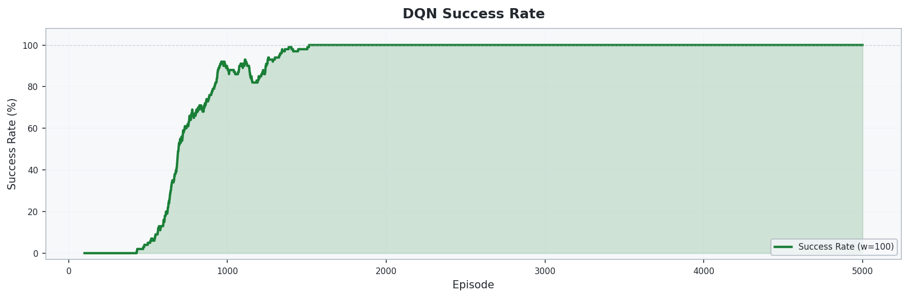
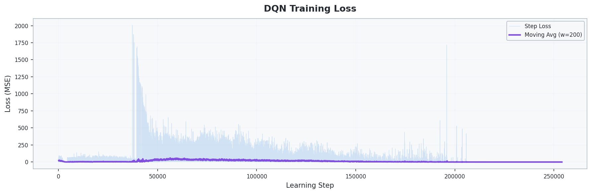

# 2_1_DQN: Deep Q-Network 기반 UAV 경로 최적화

## 개요
- **DQN(Deep Q-Network)**을 사용하여 **2D 그리드 환경에서 UAV가 장애물을 회피하며 웨이포인트를 순서대로 방문**하는 경로 최적화 문제를 해결
- 신경망으로 Q값을 근사하여 **연속적인 상태 공간**에서도 학습 가능
- **Experience Replay**와 **Target Network**로 학습 안정성 확보
- **Potential-based Reward Shaping**으로 효율적인 탐색 유도

## 환경 (Environment)

### 상태 공간 (State)
| 인덱스 | 요소 | 범위 | 설명 |
|:------:|------|:----:|------|
| 0 | `x / size` | [0, 1] | UAV의 정규화된 x좌표 |
| 1 | `y / size` | [0, 1] | UAV의 정규화된 y좌표 |
| 2 | `energy / budget` | [0, 1] | 정규화된 잔여 에너지 |
| 3–4 | `wp_visited` | {0, 1} | 각 웨이포인트 방문 여부 |
| 5–8 | `adj_4dir` | {0, 1} | 인접 4방향 장애물/벽 여부 (상/하/좌/우) |
| 9 | `dx_wp / size` | [-1, 1] | 다음 목표 WP까지 x방향 정규화 거리 |
| 10 | `dy_wp / size` | [-1, 1] | 다음 목표 WP까지 y방향 정규화 거리 |

> 총 **11차원** 연속 상태 벡터 — 모든 값이 정규화되어 신경망 학습에 유리합니다.

### 행동 공간 (Action)
| Action | 방향 |
|:------:|------|
| 0 | ↑ 상 |
| 1 | ↓ 하 |
| 2 | ← 좌 |
| 3 | → 우 |

### 환경 설정
| 항목 | 설정값 |
|------|--------|
| 그리드 크기 | 20 × 20 |
| 행동 공간 | 이산 4방향 (상/하/좌/우) |
| 웨이포인트 | 2개 (중간 지점 `(10,10)`, 끝 지점 `(19,19)`), **순서대로 방문** |
| 장애물 | 고정 배치, 약 40개 (`size²/10`) |
| 에너지 예산 | 최단 맨해튼 경로 × 2.0배 |
| 시작 위치 | (0, 0) |
| 최대 스텝 | 400 (`size²`) |

### 보상 체계 (Reward)
| 이벤트 | 보상 | 설계 의도 |
|--------|------|-----------|
| 이동 (매 스텝) | **-1.0** | 불필요한 이동 억제 |
| 웨이포인트 도달 | +100.0 | 웨이포인트 방문 유도 |
| 전체 임무 완료 | +200.0 | 모든 웨이포인트 방문 시 추가 보상 |
| 벽 충돌 | -5.0 | 경계 밖 이동 방지 |
| 장애물 충돌 | -10.0 | 장애물 회피 유도 |
| 에너지 소진 | -50.0 | 에너지 관리 학습 유도 |
| Reward Shaping | $\gamma \cdot \Phi(s') - \Phi(s)$ | 목표에 가까워질수록 보상 |

> **Potential-based Reward Shaping**: 다음 목표 웨이포인트까지의 맨해튼 거리를 포텐셜 함수 $\Phi(s)$로 사용하여 올바른 방향으로의 이동을 유도합니다.

## 알고리즘

### DQN (Deep Q-Network)

**Q-Network Update:**

$$L(\theta) = \mathbb{E}\left[\left( r + \gamma \max_{a'} Q(s', a'; \theta^{-}) - Q(s, a; \theta) \right)^2\right]$$

- **Q-Network**: 2-Layer Fully Connected (256 hidden units, ReLU)
- **Experience Replay**: 과거 경험을 버퍼에 저장 후 랜덤 샘플링으로 학습 → i.i.d. 위반 해소
- **Target Network**: 일정 주기마다 Q-Network 가중치를 복사하여 학습 안정화
- **탐색 전략**: ε-greedy (에피소드마다 ε 감쇠)

### 네트워크 구조
```
Input (11) → Linear(256) → ReLU → Linear(256) → ReLU → Linear(4) → Q-values
```

### 하이퍼파라미터
| 파라미터 | 값 | 설명 |
|----------|-----|------|
| 학습률 (lr) | 5e-4 | Adam optimizer |
| 할인율 (γ) | 0.99 | 미래 보상의 중요도 |
| 초기 ε | 1.0 | 초기 완전 랜덤 탐색 |
| 최소 ε | 0.01 | 학습 후에도 1% 탐색 유지 |
| ε 감쇠율 | 0.999 | 에피소드당 ε 감쇠 |
| 배치 크기 | 64 | 미니배치 샘플 수 |
| 버퍼 크기 | 100,000 | Experience Replay 용량 |
| Target 업데이트 주기 | 500 steps | Target Network 가중치 복사 주기 |
| Hidden 차원 | 256 | 은닉층 뉴런 수 |
| 에피소드 수 | 5,000 | 총 학습 에피소드 |

## TQL 대비 개선점
| 항목 | 1_TQL | 2_1_DQN |
|------|-------|---------|
| Q값 저장 | Q-테이블 (이산 상태) | 신경망 근사 (연속 상태) |
| 그리드 크기 | 10×10 | 20×20 |
| 상태 표현 | 튜플 (x, y, energy, visited) | 11차원 정규화 벡터 |
| 추가 정보 | 없음 | 인접 장애물 감지 + 목표 방향 |
| Reward Shaping | 없음 | Potential-based Shaping |
| 학습 안정화 | N/A | Experience Replay + Target Network |

## 실행 방법
```bash
cd 2_1_DQN
python train.py
```

## 실험 결과

### 학습 곡선 (Training Curve)
에피소드별 보상 변화와 이동 평균을 통해 학습 수렴 과정을 확인할 수 있습니다.


### 성공률 (Success Rate)
에피소드별 임무 완료 성공률의 변화입니다.



### 학습 손실 (Training Loss)
Q-Network의 MSE 손실 변화 추이입니다.



### 최적 경로 (Best Path)
학습 완료 후 greedy 정책으로 에이전트가 선택한 최적 비행 경로입니다.


### 비행 경로 애니메이션

