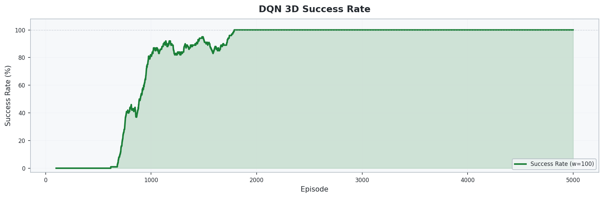
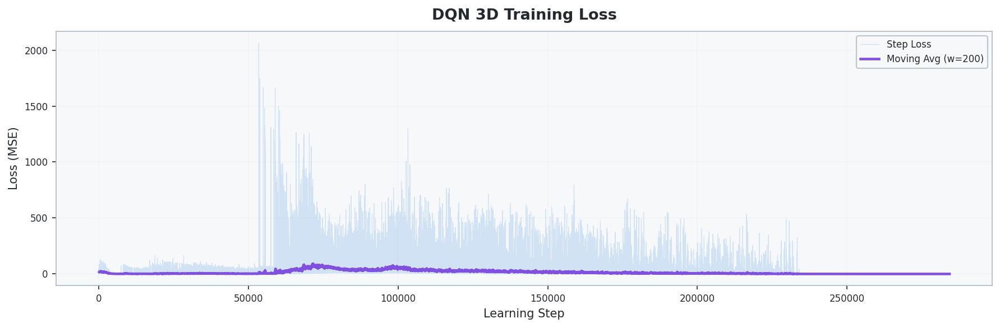

# 2_2_DQN_3D: Deep Q-Network 기반 3D UAV 경로 최적화

## 개요

- **DQN(Deep Q-Network)**을 **3D 그리드 환경**으로 확장하여 UAV가 **건물형 장애물을 회피하며 웨이포인트를 순서대로 방문**하는 경로 최적화 문제를 해결
- 2D 환경(2_1_DQN) 대비 **수직 이동(상승/하강)** 행동이 추가되어 더 복잡한 탐색 공간에서 학습
- **건물형 장애물**: 지면(z=0)에서 랜덤 높이까지 솟아오른 도시 환경 모사
- **수직 이동 에너지 차등**: 상승/하강 시 수평 이동 대비 1.5배 에너지 소모

## 환경 (Environment)

### 상태 공간 (State)

| 인덱스 | 요소 | 범위 | 설명 |
| :------: | ------ | :----: | ------ |
| 0 | `x / sx` | [0, 1] | UAV의 정규화된 x좌표 |
| 1 | `y / sy` | [0, 1] | UAV의 정규화된 y좌표 |
| 2 | `z / sz` | [0, 1] | UAV의 정규화된 z좌표 (고도) |
| 3 | `energy / budget` | [0, 1] | 정규화된 잔여 에너지 |
| 4–5 | `wp_visited` | {0, 1} | 각 웨이포인트 방문 여부 |
| 6–11 | `adj_6dir` | {0, 1} | 인접 6방향 장애물/벽 여부 (+X, -X, +Y, -Y, +Z, -Z) |
| 12 | `dx_wp / sx` | [-1, 1] | 다음 목표 WP까지 x방향 정규화 거리 |
| 13 | `dy_wp / sy` | [-1, 1] | 다음 목표 WP까지 y방향 정규화 거리 |
| 14 | `dz_wp / sz` | [-1, 1] | 다음 목표 WP까지 z방향 정규화 거리 |

> 총 **15차원** 연속 상태 벡터 — 2D 대비 고도 정보와 수직 방향 감지가 추가되었습니다.

### 행동 공간 (Action)

| Action | 방향 | 설명 |
| :------: | ------ | ------ |
| 0 | +X | 전진 |
| 1 | -X | 후진 |
| 2 | +Y | 우측 |
| 3 | -Y | 좌측 |
| 4 | +Z | 상승 |
| 5 | -Z | 하강 |

### 환경 설정

| 항목 | 설정값 |
| ------ | -------- |
| 그리드 크기 | 20 × 20 × 5 (x × y × z) |
| 행동 공간 | 이산 6방향 (+X, -X, +Y, -Y, +Z, -Z) |
| 웨이포인트 | 2개 (`(10,10,2)`, `(19,19,4)`), **순서대로 방문** |
| 장애물 | 건물형, 25개 건물 (z=0에서 랜덤 높이) |
| 건물 높이 범위 | 1 ~ `grid_size_z - 1` |
| 에너지 예산 | 최단 맨해튼 경로 × 2.0배 |
| 수평 이동 비용 | 1.0 |
| 수직 이동 비용 | 1.5 (수평 대비 50% 추가) |
| 시작 위치 | (0, 0, 0) |
| 최대 스텝 | 2,000 (`x × y × z`) |

### 보상 체계 (Reward)

| 이벤트 | 보상 | 설계 의도 |
| -------- | ------ | ----------- |
| 이동 (매 스텝) | **-1.0** | 불필요한 이동 억제 |
| 웨이포인트 도달 | +100.0 | 웨이포인트 방문 유도 |
| 전체 임무 완료 | +200.0 | 모든 웨이포인트 방문 시 추가 보상 |
| 벽 충돌 | -5.0 | 경계 밖 이동 방지 |
| 장애물 충돌 | -10.0 | 장애물(건물) 회피 유도 |
| 에너지 소진 | -50.0 | 에너지 관리 학습 유도 |
| Reward Shaping | $\gamma \cdot \Phi(s') - \Phi(s)$ | 목표에 가까워질수록 보상 |

> **Potential-based Reward Shaping**: 다음 목표 웨이포인트까지의 **3D 맨해튼 거리** ($|dx| + |dy| + |dz|$)를 포텐셜 함수 $\Phi(s)$로 사용합니다.

### 건물형 장애물

기존 랜덤 산개 방식 대신, **도시 환경을 모사**한 건물형 장애물을 사용합니다.

- 각 건물은 `(x, y)` 위치에 `z=0`부터 랜덤 높이까지 수직으로 솟아오른 직육면체
- UAV는 건물 위를 날아서 우회하거나, 건물 사이를 통과하는 경로를 학습
- 건물이 차지하는 `(x, y)` 위치에서는 시작점·웨이포인트와 겹치지 않도록 보호

## 알고리즘

### DQN (Deep Q-Network)

**Q-Network Update:**

$$L(\theta) = \mathbb{E}\left[\left( r + \gamma \max_{a'} Q(s', a'; \theta^{-}) - Q(s, a; \theta) \right)^2\right]$$

- **Q-Network**: 2-Layer Fully Connected (256 hidden units, ReLU)
- **Experience Replay**: 과거 경험을 버퍼에 저장 후 랜덤 샘플링으로 학습 → i.i.d. 위반 해소
- **Target Network**: 일정 주기마다 Q-Network 가중치를 복사하여 학습 안정화
- **탐색 전략**: ε-greedy (에피소드마다 ε 감쇠)

### 네트워크 구조

```text
Input (15) → Linear(256) → ReLU → Linear(256) → ReLU → Linear(6) → Q-values
```

### 하이퍼파라미터

| 파라미터 | 값 | 설명 |
| ---------- | ----- | ------ |
| 학습률 (lr) | 5e-4 | Adam optimizer |
| 할인율 (γ) | 0.99 | 미래 보상의 중요도 |
| 초기 ε | 1.0 | 초기 완전 랜덤 탐색 |
| 최소 ε | 0.01 | 학습 후에도 1% 탐색 유지 |
| ε 감쇠율 | 0.999 | 에피소드당 ε 감쇠 |
| 배치 크기 | 64 | 미니배치 샘플 수 |
| 버퍼 크기 | 100,000 | Experience Replay 용량 |
| Target 업데이트 주기 | 500 steps | Target Network 가중치 복사 주기 |
| Hidden 차원 | 256 | 은닉층 뉴런 수 |
| 에피소드 수 | 5,000 | 총 학습 에피소드 |

## 2_1_DQN 대비 개선점

| 항목 | 2_1_DQN | 2_2_DQN_3D |
| ------ | --------- | ------------ |
| 환경 차원 | 2D (20×20) | 3D (20×20×5) |
| 행동 공간 | 4방향 (상/하/좌/우) | 6방향 (+X/-X/+Y/-Y/+Z/-Z) |
| 상태 차원 | 11차원 | 15차원 |
| 장애물 유형 | 랜덤 산개 (40개 셀) | 건물형 (25개 건물, 수직 기둥) |
| 에너지 비용 | 균일 (1.0) | 수평 1.0 / 수직 1.5 |
| 포텐셜 함수 | 2D 맨해튼 거리 | 3D 맨해튼 거리 |

## 실행 방법

```bash
cd 2_2_DQN_3D
python train.py
```

## 실험 결과

### 학습 곡선 (Training Curve)

에피소드별 보상 변화와 이동 평균을 통해 학습 수렴 과정을 확인할 수 있습니다.


### 성공률 (Success Rate)

에피소드별 임무 완료 성공률의 변화입니다.



### 학습 손실 (Training Loss)

Q-Network의 MSE 손실 변화 추이입니다.



### 최적 경로 (Best Path)

학습 완료 후 greedy 정책으로 에이전트가 선택한 3D 최적 비행 경로입니다.
건물형 장애물을 우회하며 두 웨이포인트를 순서대로 방문합니다.


### 비행 경로 애니메이션


