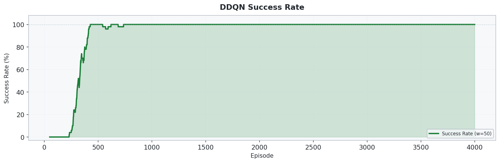
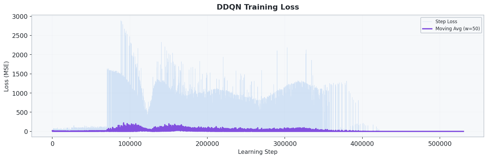

# 3_1_DDQN: Double DQN 기반 2D UAV 경로 최적화

## 개요

- **DDQN(Double Deep Q-Network)** 을 사용하여 **2D 그리드 환경에서 UAV가 장애물을 회피하며 3개의 웨이포인트를 순서대로 방문**하는 문제를 학습합니다.
- `3_1_DDQN`은 `2_1_DQN` 대비 **그리드 크기 확장(20x20 -> 50x50)**, **웨이포인트 증가(2개 -> 3개)**, **DDQN 타깃 계산**을 적용한 버전입니다.
- DDQN은 행동 선택과 행동 평가를 분리하여 **Q-value 과대추정(overestimation)** 을 완화합니다.
- **Experience Replay**, **Target Network**, **Potential-based Reward Shaping** 을 함께 사용합니다.

## 환경 (Environment)

### 상태 공간 (State)

| 인덱스 | 요소 | 범위 | 설명 |
| :---: | --- | :---: | --- |
| 0 | `x / size` | [0, 1] | UAV의 정규화된 x 좌표 |
| 1 | `y / size` | [0, 1] | UAV의 정규화된 y 좌표 |
| 2 | `energy / budget` | [0, 1] | 정규화된 잔여 에너지 |
| 3-5 | `wp_visited` | {0, 1} | 3개 웨이포인트 방문 여부 |
| 6-9 | `adj_4dir` | {0, 1} | 상/하/좌/우 인접 셀의 벽 또는 장애물 여부 |
| 10 | `dx_wp / size` | [-1, 1] | 다음 목표 WP까지 x 방향 정규화 거리 |
| 11 | `dy_wp / size` | [-1, 1] | 다음 목표 WP까지 y 방향 정규화 거리 |

> 총 **12차원** 연속 상태 벡터를 사용합니다.

### 행동 공간 (Action)

| Action | 방향 |
| :---: | --- |
| 0 | 상 |
| 1 | 하 |
| 2 | 좌 |
| 3 | 우 |

### 환경 설정

| 항목 | 설정값 |
| --- | --- |
| 그리드 크기 | 50 x 50 |
| 행동 공간 | 이산 4방향 |
| 시작 위치 | `(0, 0)` |
| 웨이포인트 | 3개 (`(16,16)`, `(32,32)`, `(49,49)`), **순서대로 방문** |
| 장애물 | 기본 고정 배치 약 250개 셀 (`size^2 / 10`) |
| 랜덤 장애물 모드 | `num_random_obstacles≈41` |
| 이동 비용 | 1.0 |
| 에너지 예산 | 최단 맨해튼 경로 x 2.8 |
| 최대 스텝 | 1500 |

### 보상 체계 (Reward)

| 이벤트 | 보상 | 설명 |
| --- | --- | --- |
| 이동 (매 스텝) | **-1.0** | 불필요한 이동 억제 |
| 웨이포인트 도달 | +100.0 | 목표 지점 방문 유도 |
| 전체 임무 완료 | +300.0 | 3개 웨이포인트 모두 방문 |
| 벽 충돌 | -5.0 | 경계 밖 이동 방지 |
| 장애물 충돌 | -10.0 | 장애물 회피 유도 |
| 에너지 소진 | -50.0 | 에너지 효율 학습 |
| Reward Shaping | `γ·Φ(s') - Φ(s)` | 다음 목표에 가까워질수록 추가 보상 |

> 포텐셜 함수 `Φ(s)` 는 다음 목표 웨이포인트까지의 **맨해튼 거리의 음수**입니다.

## 알고리즘

### DDQN (Double Deep Q-Network)

**Target Update:**

$$
y = r + \gamma \, Q_{target}(s', \arg\max_{a'} Q_{online}(s', a'))
$$

- **핵심 차이점**: DQN과 달리, 다음 행동 선택은 online network가 하고 그 행동의 평가는 target network가 담당합니다.
- **Experience Replay**: 과거 경험을 버퍼에 저장한 뒤 랜덤 샘플링하여 상관관계를 줄입니다.
- **Target Network**: 일정 스텝마다 online network 가중치를 복사해 학습을 안정화합니다.
- **탐색 전략**: `epsilon-greedy` 를 사용하며 에피소드 단위로 `epsilon` 을 감소시킵니다.

### 네트워크 구조

```text
Input (12) -> Linear(256) -> ReLU -> Linear(256) -> ReLU -> Linear(4) -> Q-values
```

### 학습 하이퍼파라미터

| 파라미터 | 값 |
| --- | --- |
| 학습률 | `3e-4` |
| 할인율 `γ` | `0.99` |
| 초기 `epsilon` | `1.0` |
| 최소 `epsilon` | `0.02` |
| `epsilon_decay` | `0.9985` |
| 배치 크기 | `128` |
| 리플레이 버퍼 | `250000` |
| 타깃 네트워크 업데이트 | `1000` steps |
| Hidden 차원 | `256` |
| Gradient clipping | `5.0` |
| 학습 에피소드 수 | `4000` |

## 실행 방법

```bash
cd 3_1_DDQN
python train.py
```

## 실험 결과

### 학습 곡선


### 성공률



### 학습 손실



### 최적 경로


### 비행 경로 애니메이션


