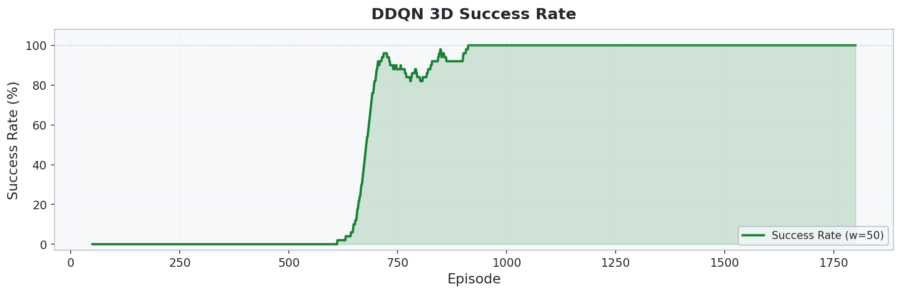
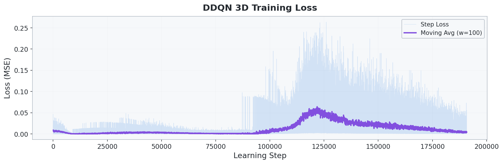

# 3_2_DDQN_3D: Double DQN 기반 3D UAV 경로 최적화

## 개요

- **DDQN(Double Deep Q-Network)** 으로 **3D 격자 공간에서 UAV가 건물형 장애물을 회피하며 3개의 웨이포인트를 순서대로 방문**하도록 학습합니다.
- `3_1_DDQN`을 3차원으로 확장한 버전으로, **6방향 이동**, **고도 축 에너지 비용**, **건물형 장애물**이 추가되었습니다.
- 행동 선택과 평가를 분리하는 DDQN 구조를 유지해 Q-value 과대추정을 줄입니다.
- 3D 환경에서도 **Reward Shaping**, **Replay Buffer**, **Target Network** 를 함께 사용합니다.

## 환경 (Environment)

### 상태 공간 (State)

| 인덱스 | 요소 | 범위 | 설명 |
| :---: | --- | :---: | --- |
| 0 | `x / sx` | [0, 1] | 정규화된 x 좌표 |
| 1 | `y / sy` | [0, 1] | 정규화된 y 좌표 |
| 2 | `z / sz` | [0, 1] | 정규화된 z 좌표 |
| 3 | `energy / budget` | [0, 1] | 정규화된 잔여 에너지 |
| 4-6 | `wp_visited` | {0, 1} | 3개 웨이포인트 방문 여부 |
| 7-12 | `adj_6dir` | {0, 1} | +X/-X/+Y/-Y/+Z/-Z 인접 차단 여부 |
| 13 | `dx_wp / sx` | [-1, 1] | 다음 목표 WP까지 x 방향 정규화 거리 |
| 14 | `dy_wp / sy` | [-1, 1] | 다음 목표 WP까지 y 방향 정규화 거리 |
| 15 | `dz_wp / sz` | [-1, 1] | 다음 목표 WP까지 z 방향 정규화 거리 |

> 총 **16차원** 상태 벡터를 사용합니다.

### 행동 공간 (Action)

| Action | 방향 |
| :---: | --- |
| 0 | +X |
| 1 | -X |
| 2 | +Y |
| 3 | -Y |
| 4 | +Z |
| 5 | -Z |

### 환경 설정

| 항목 | 설정값 |
| --- | --- |
| 공간 크기 | 50 x 50 x 8 |
| 행동 공간 | 이산 6방향 |
| 시작 위치 | `(0, 0, 0)` |
| 웨이포인트 | 3개 (`(16,16,4)`, `(32,32,4)`, `(49,49,7)`), **순서대로 방문** |
| 장애물 | 건물형 장애물 `110`개 |
| 건물 높이 | `1 ~ grid_size_z - 1` |
| 수평 이동 비용 | `1.0` |
| 수직 이동 비용 | `1.5` |
| 에너지 예산 | 가중 맨해튼 경로 비용 x `3.0` |
| 최대 스텝 | `2500` |

### 보상 체계 (Reward)

| 이벤트 | 보상 | 설명 |
| --- | --- | --- |
| 이동 (매 스텝) | **-1.0** | 짧은 경로 유도 |
| 웨이포인트 도달 | +100.0 | 목표 방문 유도 |
| 전체 임무 완료 | +300.0 | 모든 목표 방문 완료 |
| 벽 충돌 | -5.0 | 공간 경계 이탈 방지 |
| 장애물 충돌 | -10.0 | 건물 회피 유도 |
| 에너지 소진 | -50.0 | 에너지 관리 학습 |
| Reward Shaping | `γ·Φ(s') - Φ(s)` | 목표 접근 시 추가 보상 |

> 포텐셜 함수는 다음 목표 웨이포인트까지의 **3D 맨해튼 거리의 음수**입니다.

## 알고리즘

### DDQN (Double Deep Q-Network)

$$
y = r + \gamma \, Q_{target}(s', \arg\max_{a'} Q_{online}(s', a'))
$$

- **Online Network** 가 다음 행동을 선택하고, **Target Network** 가 해당 행동의 가치를 평가합니다.
- **Replay Buffer** 로 경험을 재사용하며, **Hard update** 방식으로 타깃 네트워크를 갱신합니다.
- 3D 환경에서도 `epsilon-greedy` 탐색을 유지합니다.

### 네트워크 구조

```text
Input (16) -> Linear(384) -> ReLU -> Linear(384) -> ReLU -> Linear(6) -> Q-values
```

### 학습 하이퍼파라미터

| 파라미터 | 값 |
| --- | --- |
| 학습률 | `3e-4` |
| 할인율 `γ` | `0.99` |
| 초기 `epsilon` | `1.0` |
| 최소 `epsilon` | `0.03` |
| `epsilon_decay` | `0.9993` |
| 배치 크기 | `128` |
| 리플레이 버퍼 | `400000` |
| 타깃 네트워크 업데이트 | `1500` steps |
| Hidden 차원 | `384` |
| Gradient clipping | `5.0` |
| 학습 에피소드 수 | `6000` |

## 실행 방법

```bash
cd 3_2_DDQN_3D
python train.py
```

## 실험 결과

### 학습 곡선


### 성공률



### 학습 손실



### 최적 경로


### 비행 경로 애니메이션


