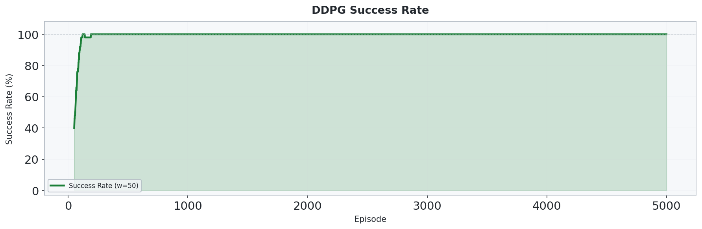
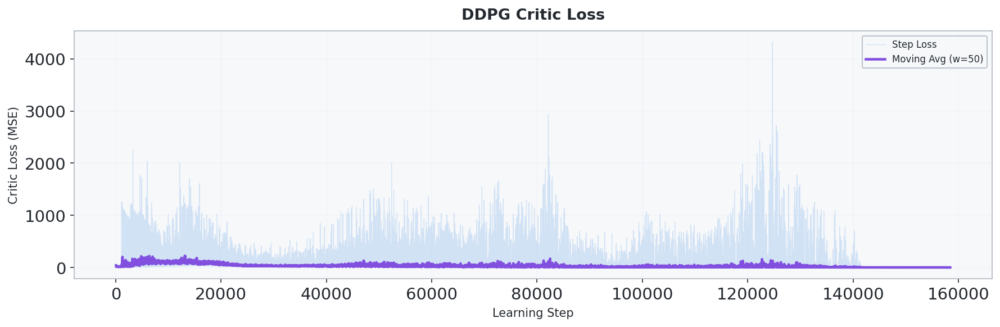
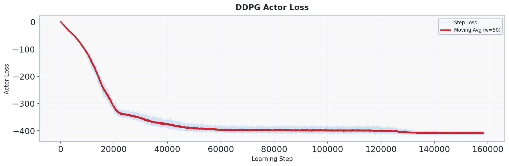

# 4_1_DDPG: DDPG 기반 2D 연속 제어 UAV 경로 최적화

## 개요

- **DDPG(Deep Deterministic Policy Gradient)** 를 사용하여 **2D 연속 좌표 환경에서 UAV가 부드러운 연속 이동으로 3개의 웨이포인트를 방문**하도록 학습합니다.
- `3_1_DDQN` 대비 가장 큰 차이는 **이산 행동이 아닌 연속 행동 공간**을 사용한다는 점입니다.
- Actor-Critic 구조를 통해 **정책 네트워크(Actor)** 와 **가치 네트워크(Critic)** 를 함께 학습합니다.
- 탐색은 `epsilon-greedy` 대신 **OU Noise** 로 수행하며, 타깃 네트워크는 **soft update** 를 사용합니다.

## 환경 (Environment)

### 상태 공간 (State)

| 인덱스 | 요소 | 범위 | 설명 |
| :---: | --- | :---: | --- |
| 0 | `x / size` | [0, 1] | 정규화된 x 좌표 |
| 1 | `y / size` | [0, 1] | 정규화된 y 좌표 |
| 2 | `energy / budget` | [0, 1] | 정규화된 잔여 에너지 |
| 3-5 | `wp_visited` | {0, 1} | 3개 웨이포인트 방문 여부 |
| 6-13 | `adj_8dir` | {0, 1} | 8방향 인접 셀의 장애물/벽 정보 |
| 14 | `dx_wp / size` | [-1, 1] | 다음 목표 WP까지 x 방향 정규화 거리 |
| 15 | `dy_wp / size` | [-1, 1] | 다음 목표 WP까지 y 방향 정규화 거리 |

> 총 **16차원** 상태 벡터를 사용합니다.

### 행동 공간 (Action)

| 요소 | 범위 | 설명 |
| --- | --- | --- |
| `action[0]` | [-1, 1] | x 방향 이동 비율 |
| `action[1]` | [-1, 1] | y 방향 이동 비율 |

실제 이동량은 다음과 같습니다.

```text
dx = action[0] * max_step_size
dy = action[1] * max_step_size
```

### 환경 설정

| 항목 | 설정값 |
| --- | --- |
| 공간 크기 | 100 x 100 |
| 행동 공간 | 연속 2차원 `Box(-1, 1, shape=(2,))` |
| 시작 위치 | `(0.5, 0.5)` |
| 웨이포인트 | 3개 (`(33.5,33.5)`, `(66.5,66.5)`, `(99.5,99.5)`), **순서대로 방문** |
| 장애물 | 기본 고정 배치 약 1000개 셀 |
| 최대 이동량 | `2.2` |
| 웨이포인트 도달 반경 | `1.8` |
| 에너지 예산 | 유클리드 경로 길이 x `3.4` |
| 최대 스텝 | `1200` |

### 보상 체계 (Reward)

| 이벤트 | 보상 | 설명 |
| --- | --- | --- |
| 이동 (매 스텝) | **-0.5** | 지나친 이동 억제 |
| 웨이포인트 도달 | +100.0 | 목표 방문 유도 |
| 전체 임무 완료 | +300.0 | 모든 목표 방문 완료 |
| 벽 충돌 | -5.0 | 경계 이탈 방지 |
| 장애물 충돌 | -10.0 | 장애물 회피 유도 |
| 에너지 소진 | -50.0 | 에너지 효율 학습 |
| Reward Shaping | `γ·Φ(s') - Φ(s)` | 목표 접근 시 추가 보상 |

> 포텐셜 함수는 다음 목표까지의 **유클리드 거리의 음수**입니다.

## 알고리즘

### DDPG (Deep Deterministic Policy Gradient)

**Critic update**

$$
L(\theta^Q) = \mathbb{E}\left[\left(Q(s,a) - \left(r + \gamma Q'(s', \mu'(s'))\right)\right)^2\right]
$$

**Actor update**

$$
\nabla_{\theta^\mu} J \approx \mathbb{E}\left[\nabla_a Q(s,a)\vert_{a=\mu(s)} \nabla_{\theta^\mu}\mu(s)\right]
$$

- **Actor**: 상태를 받아 연속 행동을 출력합니다.
- **Critic**: 상태와 행동을 함께 받아 Q-value를 추정합니다.
- **OU Noise**: 연속 제어에 적합한 시간 상관 탐색 노이즈를 사용합니다.
- **Soft Target Update**: `τ` 기반 Polyak averaging 으로 학습을 안정화합니다.

### 네트워크 구조

```text
Actor : Input (16) -> Linear(256) -> ReLU -> Linear(256) -> ReLU -> Linear(2) -> tanh
Critic: Input (16 + 2) -> Linear(256) -> ReLU -> Linear(256) -> ReLU -> Linear(1)
```

### 학습 하이퍼파라미터

| 파라미터 | 값 |
| --- | --- |
| Actor 학습률 | `1e-4` |
| Critic 학습률 | `1e-3` |
| 할인율 `γ` | `0.99` |
| Soft update `τ` | `0.005` |
| 배치 크기 | `128` |
| 리플레이 버퍼 | `250000` |
| Hidden 차원 | `256` |
| 초기 OU noise `σ` | `0.4` |
| 최소 OU noise `σ` | `0.025` |
| Noise decay | `0.9983` |
| Gradient clipping | `1.0` |
| 학습 주기 | `learn_every=2` |
| 학습 에피소드 수 | `5000` |

## 실행 방법

```bash
cd 4_1_DDPG
python train.py
```

## 실험 결과

### 학습 곡선


### 성공률



### Critic 손실



### Actor 손실



### 최적 경로


### 비행 경로 애니메이션


