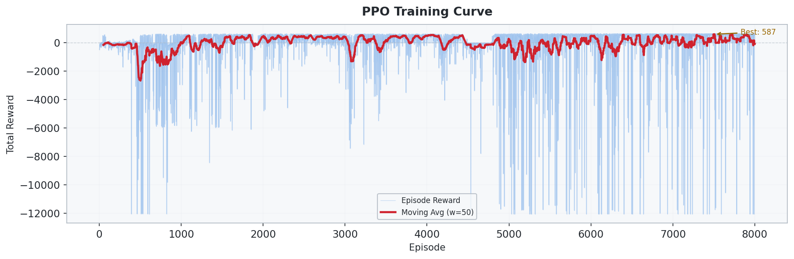
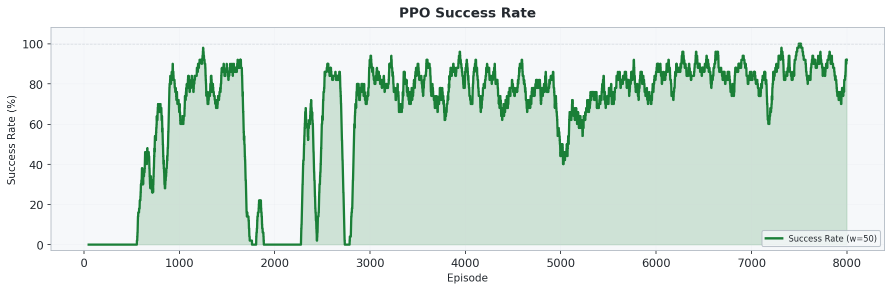
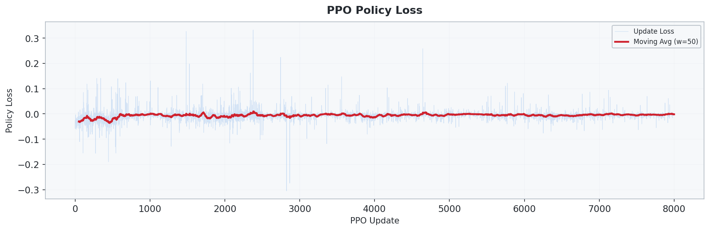
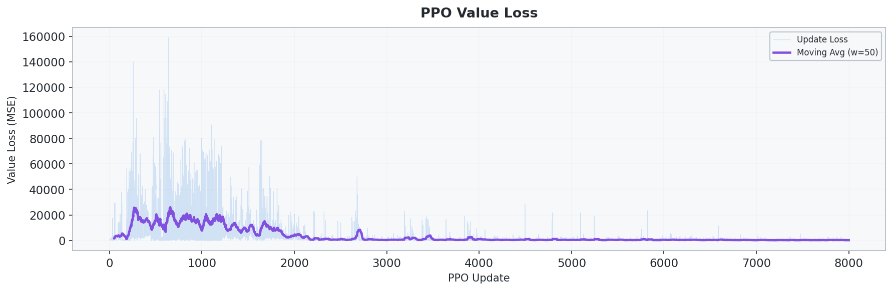
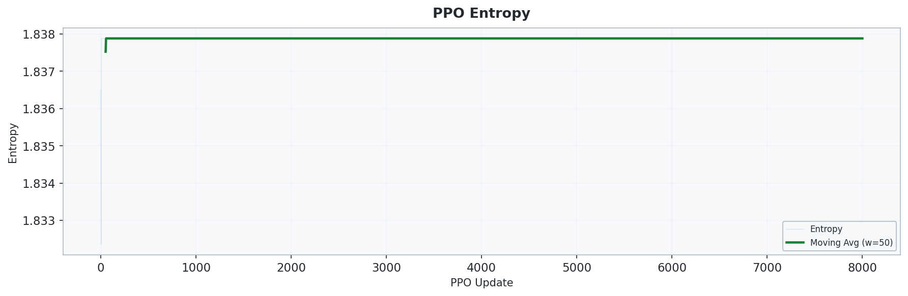
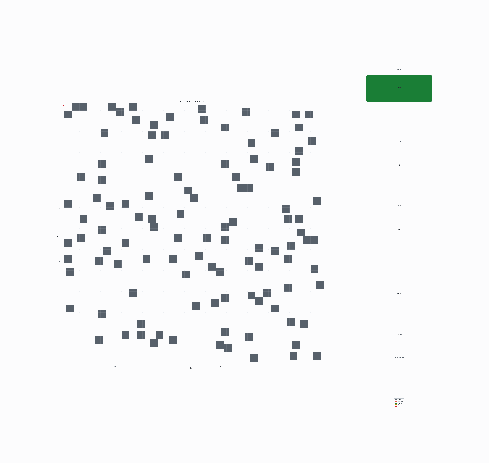

# 5_1_PPO: PPO 기반 2D 연속 제어 UAV 경로 최적화

## 개요

- **PPO(Proximal Policy Optimization)** 를 사용하여 **2D 연속 좌표 환경에서 UAV의 비행 정책을 확률적으로 학습**합니다.
- `4_1_DDPG` 와 동일한 연속 환경을 사용하지만, DDPG의 off-policy deterministic 정책 대신 **on-policy stochastic 정책**으로 학습합니다.
- **GAE(Generalized Advantage Estimation)**, **Clipped Surrogate Objective**, **Entropy Bonus**, **Learning Rate Annealing** 을 함께 사용합니다.
- 같은 환경에서 DDPG보다 더 안정적인 정책 업데이트를 목표로 합니다.

## 환경 (Environment)

### 상태 공간 (State)

| 인덱스 | 요소 | 범위 | 설명 |
| :---: | --- | :---: | --- |
| 0 | `x / size` | [0, 1] | 정규화된 x 좌표 |
| 1 | `y / size` | [0, 1] | 정규화된 y 좌표 |
| 2 | `energy / budget` | [0, 1] | 정규화된 잔여 에너지 |
| 3-5 | `wp_visited` | {0, 1} | 3개 웨이포인트 방문 여부 |
| 6-13 | `adj_8dir` | {0, 1} | 8방향 장애물/경계 정보 |
| 14 | `dx_wp / size` | [-1, 1] | 다음 목표 WP까지 x 방향 정규화 거리 |
| 15 | `dy_wp / size` | [-1, 1] | 다음 목표 WP까지 y 방향 정규화 거리 |

> 총 **16차원** 상태 벡터를 사용합니다.

### 행동 공간 (Action)

| 요소 | 범위 | 설명 |
| --- | --- | --- |
| `action[0]` | [-1, 1] | x 방향 이동 비율 |
| `action[1]` | [-1, 1] | y 방향 이동 비율 |

실제 이동량:

```text
dx = action[0] * max_step_size
dy = action[1] * max_step_size
```

### 환경 설정

| 항목 | 설정값 |
| --- | --- |
| 공간 크기 | 30 x 30 |
| 행동 공간 | 연속 2차원 `Box(-1, 1, shape=(2,))` |
| 시작 위치 | `(0.5, 0.5)` |
| 웨이포인트 | 3개 (`(10.5,10.5)`, `(20.5,20.5)`, `(29.5,29.5)`), **순서대로 방문** |
| 장애물 | 기본 고정 배치 약 90개 셀 |
| 최대 이동량 | `1.5` |
| 웨이포인트 도달 반경 | `1.0` |
| 에너지 예산 | 유클리드 경로 길이 x `3.0` |
| 최대 스텝 | `300` |

### 보상 체계 (Reward)

| 이벤트 | 보상 |
| --- | --- |
| 이동 (매 스텝) | **-0.5** |
| 웨이포인트 도달 | +100.0 |
| 전체 임무 완료 | +300.0 |
| 벽 충돌 | -5.0 |
| 장애물 충돌 | -10.0 |
| 에너지 소진 | -50.0 |
| Reward Shaping | `γ·Φ(s') - Φ(s)` |

> 포텐셜 함수는 다음 목표까지의 **유클리드 거리의 음수**입니다.

## 알고리즘

### PPO (Proximal Policy Optimization)

**Clipped objective**

$$
L^{CLIP}(\theta) = \mathbb{E}\left[\min\left(r_t(\theta)\hat{A}_t,\ \text{clip}(r_t(\theta), 1-\epsilon, 1+\epsilon)\hat{A}_t\right)\right]
$$

- **On-policy 학습**: 현재 정책으로 수집한 rollout 데이터만 사용합니다.
- **확률적 정책**: Actor는 평균과 분산을 통해 가우시안 정책을 정의합니다.
- **GAE**: Advantage 추정을 안정화합니다.
- **Entropy bonus**: 너무 이른 수렴을 막고 탐색을 유지합니다.
- **LR annealing**: 학습 후반부에 업데이트를 더 안정적으로 만듭니다.

### 네트워크 구조

```text
Actor : Input (16) -> Linear(256) -> ReLU -> Linear(256) -> ReLU -> Gaussian policy
Critic: Input (16) -> Linear(256) -> ReLU -> Linear(256) -> ReLU -> V(s)
```

### 학습 하이퍼파라미터

| 파라미터 | 값 |
| --- | --- |
| 학습률 | `3e-4` |
| 할인율 `γ` | `0.99` |
| `gae_lambda` | `0.95` |
| `clip_epsilon` | `0.2` |
| `entropy_coeff` | `0.01` |
| `value_coeff` | `0.25` |
| `max_grad_norm` | `0.5` |
| `k_epochs` | `10` |
| mini-batch 크기 | `64` |
| Hidden 차원 | `256` |
| 학습 에피소드 수 | `8000` |

## 실행 방법

```bash
cd 5_1_PPO
python train.py
```

## 실험 결과

### 학습 곡선



### 성공률



### Policy 손실



### Value 손실



### 엔트로피 추이



### 최적 경로


### 비행 경로 애니메이션


