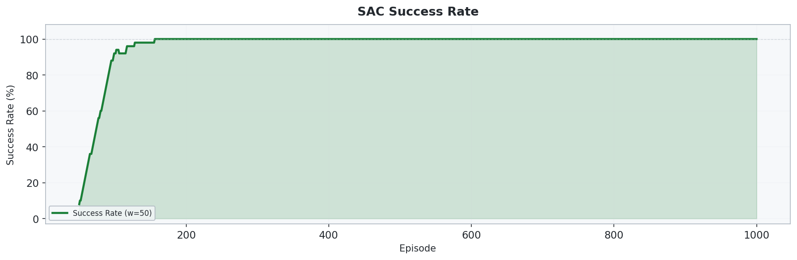
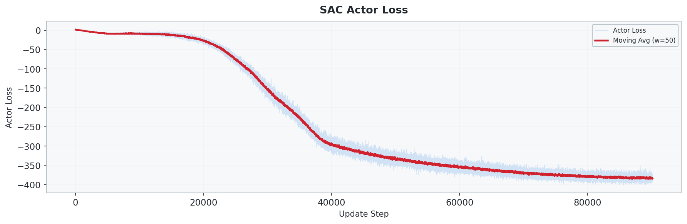
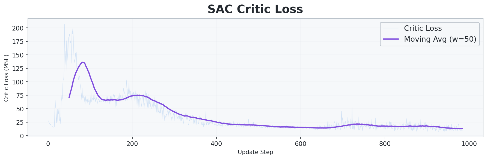
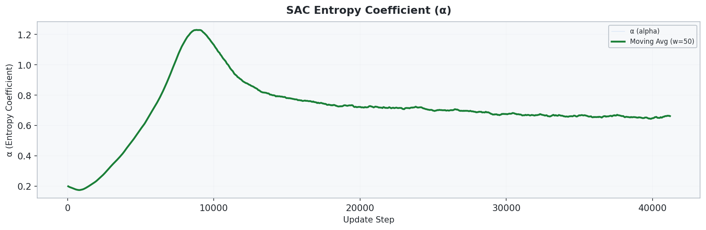

# 6_1_SAC: SAC 기반 2D 연속 제어 UAV 경로 최적화

## 개요

- **SAC(Soft Actor-Critic)** 를 사용하여 **2D 연속 환경에서 UAV의 확률적 정책을 오프폴리시 방식으로 학습**합니다.
- `5_1_PPO` 와 동일한 연속 환경을 사용하지만, PPO의 on-policy 구조 대신 **Replay Buffer 기반 off-policy 학습**을 수행합니다.
- **Twin Q-Network**, **Gaussian Policy**, **Automatic Entropy Tuning(alpha)**, **Soft Target Update** 가 핵심입니다.
- 탐색 성능과 샘플 효율을 동시에 높이는 것이 목표입니다.

## 환경 (Environment)

### 상태 공간 (State)

| 인덱스 | 요소 | 범위 | 설명 |
| :---: | --- | :---: | --- |
| 0 | `x / size` | [0, 1] | 정규화된 x 좌표 |
| 1 | `y / size` | [0, 1] | 정규화된 y 좌표 |
| 2 | `energy / budget` | [0, 1] | 정규화된 잔여 에너지 |
| 3-5 | `wp_visited` | {0, 1} | 3개 웨이포인트 방문 여부 |
| 6-13 | `adj_8dir` | {0, 1} | 8방향 장애물/경계 정보 |
| 14 | `dx_wp / size` | [-1, 1] | 다음 목표 WP까지 x 방향 정규화 거리 |
| 15 | `dy_wp / size` | [-1, 1] | 다음 목표 WP까지 y 방향 정규화 거리 |

> 총 **16차원** 상태 벡터를 사용합니다.

### 행동 공간 (Action)

| 요소 | 범위 | 설명 |
| --- | --- | --- |
| `action[0]` | [-1, 1] | x 방향 이동 비율 |
| `action[1]` | [-1, 1] | y 방향 이동 비율 |

실제 이동량은 `max_step_size=1.5` 로 스케일됩니다.

### 환경 설정

| 항목 | 설정값 |
| --- | --- |
| 공간 크기 | 30 x 30 |
| 행동 공간 | 연속 2차원 `Box(-1, 1, shape=(2,))` |
| 시작 위치 | `(0.5, 0.5)` |
| 웨이포인트 | 3개 (`(10.5,10.5)`, `(20.5,20.5)`, `(29.5,29.5)`), **순서대로 방문** |
| 장애물 | 기본 고정 배치 약 90개 셀 |
| 최대 이동량 | `1.5` |
| 웨이포인트 도달 반경 | `1.0` |
| 에너지 예산 | 유클리드 경로 길이 x `3.0` |
| 최대 스텝 | `300` |

### 보상 체계 (Reward)

| 이벤트 | 보상 |
| --- | --- |
| 이동 (매 스텝) | **-0.5** |
| 웨이포인트 도달 | +100.0 |
| 전체 임무 완료 | +300.0 |
| 벽 충돌 | -5.0 |
| 장애물 충돌 | -10.0 |
| 에너지 소진 | -50.0 |
| Reward Shaping | `γ·Φ(s') - Φ(s)` |

> 포텐셜 함수는 다음 목표까지의 **유클리드 거리의 음수**입니다.

## 알고리즘

### SAC (Soft Actor-Critic)

- **Actor**: Squashed Gaussian Policy (`tanh`) 로 연속 행동을 샘플링합니다.
- **Twin Critic**: 두 개의 Q-network 를 사용해 Q-value 과대추정을 줄입니다.
- **Entropy regularization**: `alpha` 를 자동 조절해 탐색 강도를 학습 중 스스로 조정합니다.
- **Soft target update**: Critic target network 를 천천히 갱신합니다.

### 네트워크 구조

```text
Actor  : Input (16) -> Linear(256) -> ReLU -> Linear(256) -> ReLU -> mean/log_std -> tanh
Critic : Input (16 + 2) -> Linear(256) -> ReLU -> Linear(256) -> ReLU -> Q1, Q2
```

### 학습 하이퍼파라미터

| 파라미터 | 값 |
| --- | --- |
| Actor 학습률 | `3e-4` |
| Critic 학습률 | `3e-4` |
| Alpha 학습률 | `3e-4` |
| 할인율 `γ` | `0.99` |
| Soft update `τ` | `0.005` |
| 배치 크기 | `256` |
| 리플레이 버퍼 | `200000` |
| Hidden 차원 | `256` |
| 초기 `alpha` | `0.2` |
| 랜덤 탐색 구간 | `1000` steps |
| 업데이트 주기 | `2` steps |
| 학습 에피소드 수 | `1500` |

## 실행 방법

```bash
cd 6_1_SAC
python train.py
```

## 실험 결과

### 학습 곡선


### 성공률



### Actor 손실



### Critic 손실



### 엔트로피 계수(alpha)



### 최적 경로


### 비행 경로 애니메이션


