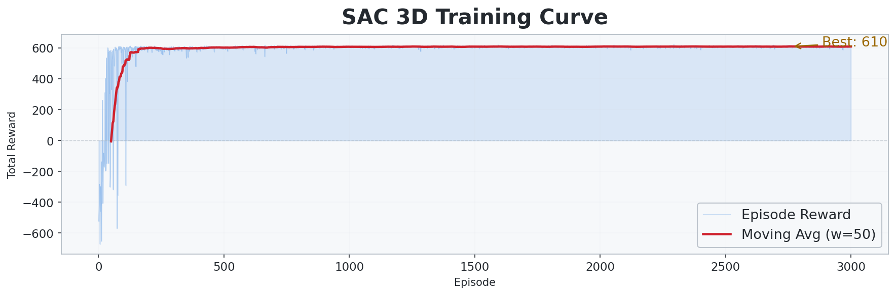
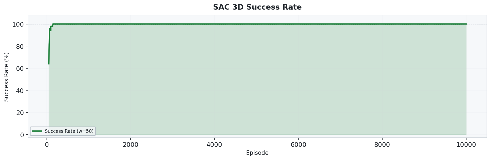
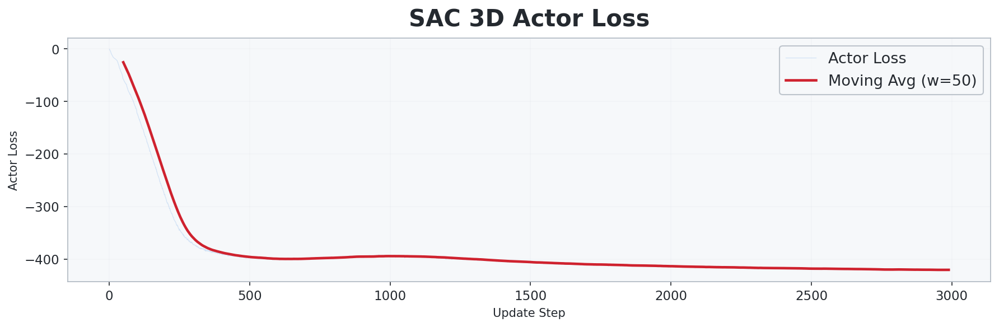
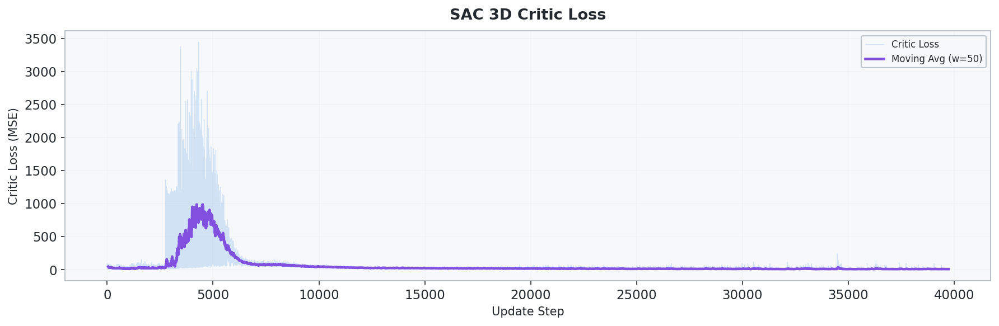
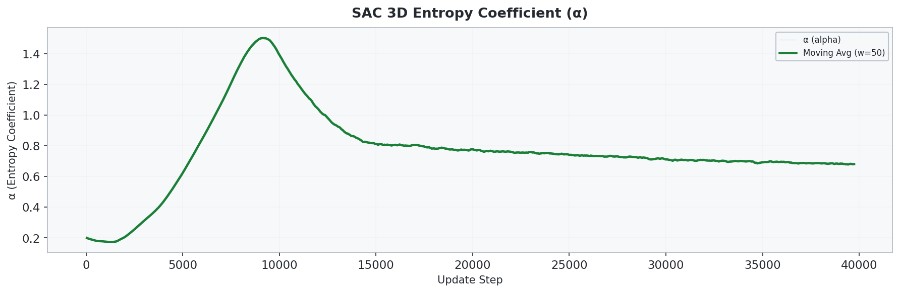
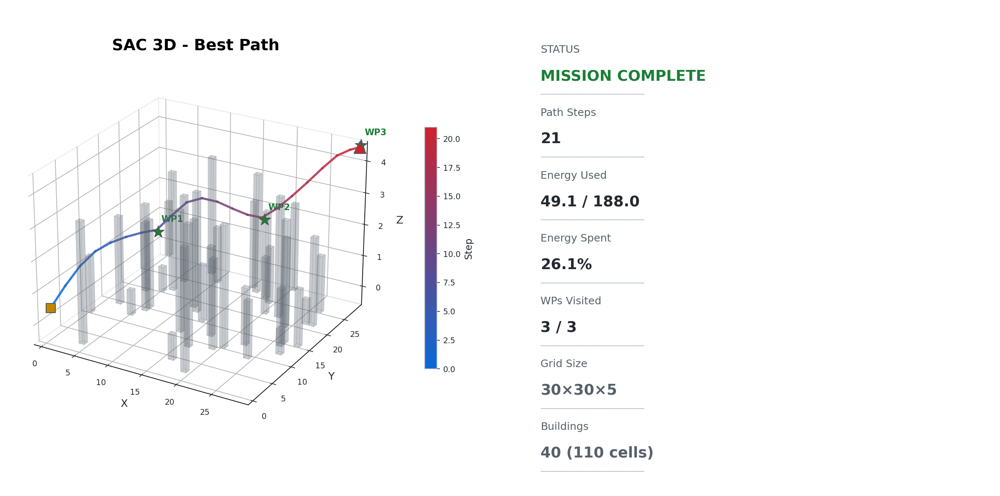
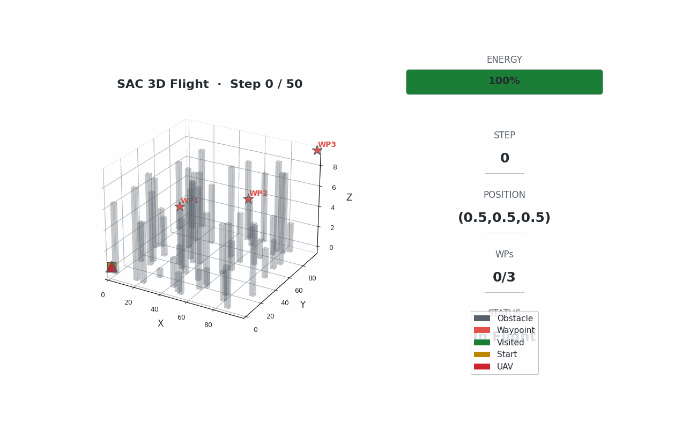

# 6_2_SAC_3D: SAC 기반 3D 연속 제어 UAV 경로 최적화

## 개요

`6_2_SAC_3D`는 `5_2_PPO_3D`와 같은 확장 3D 환경을 사용하되, 학습은 Soft Actor-Critic 방식으로 수행합니다. UAV는 `100 x 100 x 10` 공간에서 `3 x 3` footprint 건물을 피하면서 3개의 waypoint를 순서대로 방문해야 합니다.

SAC는 replay buffer 기반 off-policy 알고리즘이므로, 큰 3D map에 맞춰 replay 용량, random warm-up, discount, actor/alpha learning rate, gradient clipping을 함께 조정했습니다.

## 환경 설정

| 항목 | 값 |
| --- | --- |
| 공간 크기 | `100 x 100 x 10` |
| 시작 위치 | `(0.5, 0.5, 0.5)` |
| Waypoints | `(33.5, 33.5, 5.5)`, `(66.5, 66.5, 5.5)`, `(99.5, 99.5, 9.5)` |
| 장애물 | `3 x 3` footprint 건물 `50`개 |
| 건물 높이 | `1`부터 `grid_size_z - 1`까지 |
| 최대 이동량 | XY `2.2`, Z `1.0` |
| Waypoint 도달 반경 | `2.0` |
| Z축 이동 비용 가중치 | `1.7` |
| Z축 방향 반전 페널티 | `-1.0` |
| 에너지 예산 | waypoint 기준 경로 비용 x `3.6` |
| 최대 step | `1500` |

장애물은 `env/config.py`에서 footprint-aware 방식으로 생성됩니다. 각 건물은 `x0`, `y0`, `size_x`, `size_y`, `height` 메타데이터를 가지며, 실제 충돌 판정은 해당 footprint와 높이에 포함되는 모든 3D cell을 사용합니다.

## 상태와 행동

상태 벡터는 총 `24`차원입니다.

| 구간 | 의미 |
| --- | --- |
| `0-2` | 정규화된 UAV 위치 `(x, y, z)` |
| `3` | 정규화된 잔여 에너지 |
| `4-6` | waypoint 방문 여부 |
| `7-20` | 14방향 인접 장애물/경계 감지 |
| `21-23` | 다음 waypoint까지의 정규화된 3D 방향 |

행동 공간은 연속 3차원 `Box(-1, 1, shape=(3,))`입니다.

```text
dx = action[0] * max_step_size
dy = action[1] * max_step_size
dz = action[2] * max_step_size_z
```

## 보상

| 이벤트 | 값 |
| --- | --- |
| 매 step | `-0.5` |
| waypoint 도달 | `+100.0` |
| 전체 mission 완료 | `+300.0` |
| 벽 충돌 | `-5.0` |
| 장애물 충돌 | `-10.0` |
| Z축 방향 반전 | `-1.0` |
| 에너지 소진 | `-50.0` |
| potential shaping | `gamma * Phi(s') - Phi(s)`, `gamma=0.99` |

## SAC 튜닝값

| 파라미터 | 값 |
| --- | --- |
| 학습 episode | `7000` |
| Actor learning rate | `1.5e-4` |
| Critic learning rate | `3e-4` |
| Alpha learning rate | `1e-4` |
| Gamma | `0.995` |
| Tau | `0.005` |
| Batch size | `256` |
| Replay buffer | `750000` |
| Random exploration warm-up | `10000` steps |
| Update interval | every `1` step |
| Initial alpha | `0.2` |
| Gradient clip | `1.0` |
| Hidden dim | `256` |

큰 3D 환경은 waypoint 보상이 멀고 episode가 길기 때문에 `gamma`를 높이고 replay buffer와 warm-up을 늘렸습니다. Actor와 alpha learning rate는 낮춰서 정책과 entropy 계수가 급격히 흔들리지 않도록 했고, critic/actor gradient clipping으로 긴 rollout에서 생기는 큰 TD 오차를 완화합니다.

학습 중 가장 좋은 100-episode rolling success checkpoint는 `sac_3d_best_model.pt`로 저장되고, 마지막 모델은 `sac_3d_model.pt`로 저장됩니다.

## 실행

PowerShell에서 repo root 기준:

```powershell
cd .\6_2_SAC_3D
..\venv\Scripts\python.exe .\train.py
```

저장된 모델과 로그를 다시 평가/시각화할 때:

```powershell
cd .\6_2_SAC_3D
..\venv\Scripts\python.exe .\test.py
```

## 실험 결과 시각화

### 학습 곡선 (Training Curve)



### 성공률 (Success Rate)



### Actor Loss



### Critic Loss



### Alpha Curve



### 최적 경로 3D (Best Path 3D)



### 비행 경로 애니메이션 (Flight GIF)



## 결과 파일

| 파일 | 내용 |
| --- | --- |
| `sac_3d_model.pt` | 마지막 SAC 3D 모델 |
| `sac_3d_best_model.pt` | 100-episode rolling success 기준 best checkpoint |
| `training_log.csv` | episode별 reward, success, alpha, loss, buffer size |
| `training_curve.png` | reward 곡선 |
| `success_curve.png` | success rate 곡선 |
| `actor_loss.png` | actor loss |
| `critic_loss.png` | critic loss |
| `alpha_curve.png` | entropy coefficient alpha |
| `best_path_3d.png` | 최종/최고 경로 3D plot |
| `flight_3d.gif` | 비행 경로 애니메이션 |
