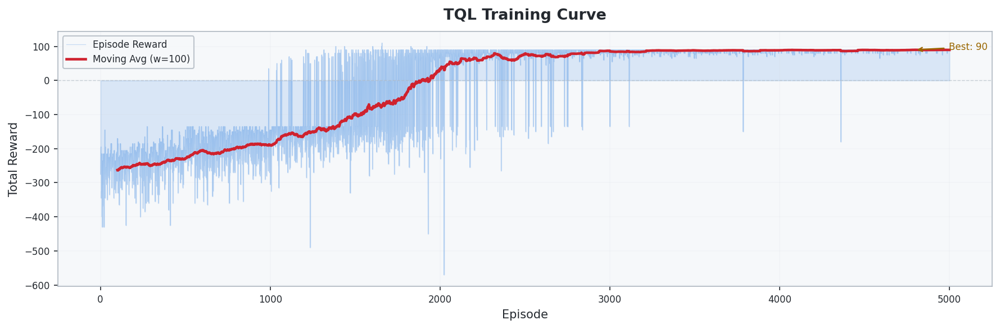
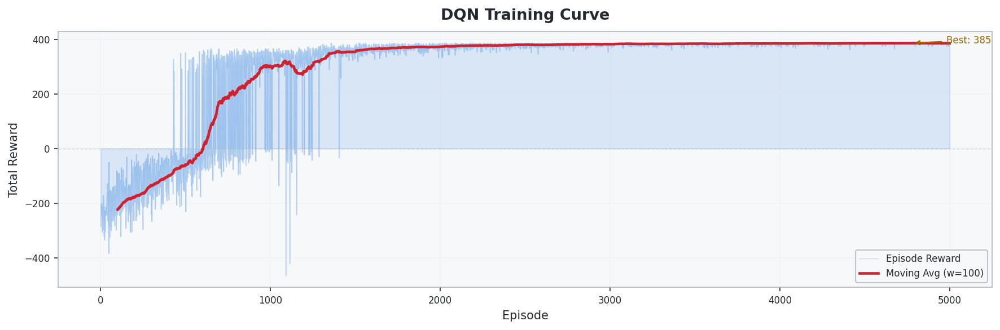
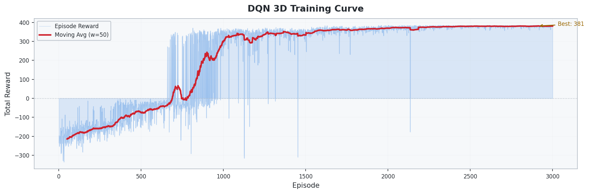
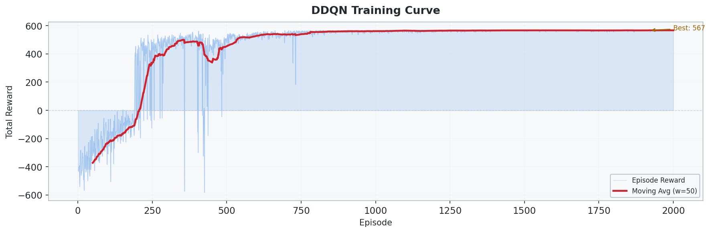
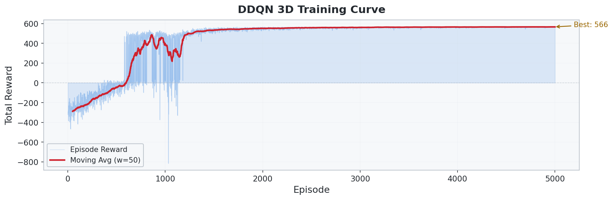
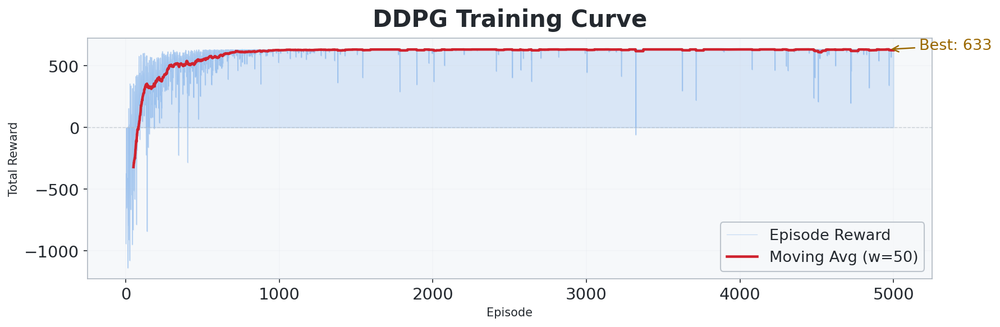
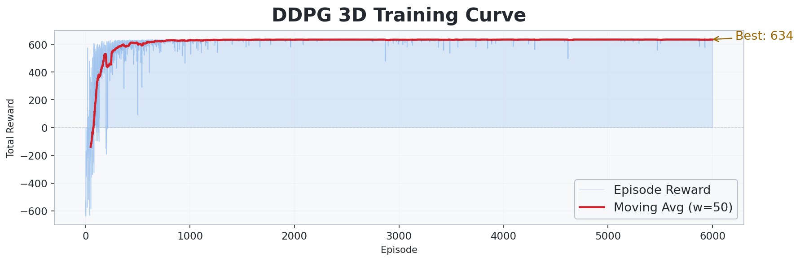
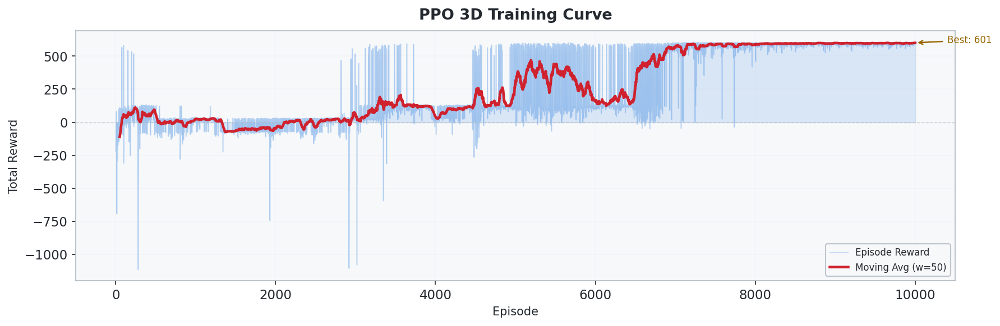
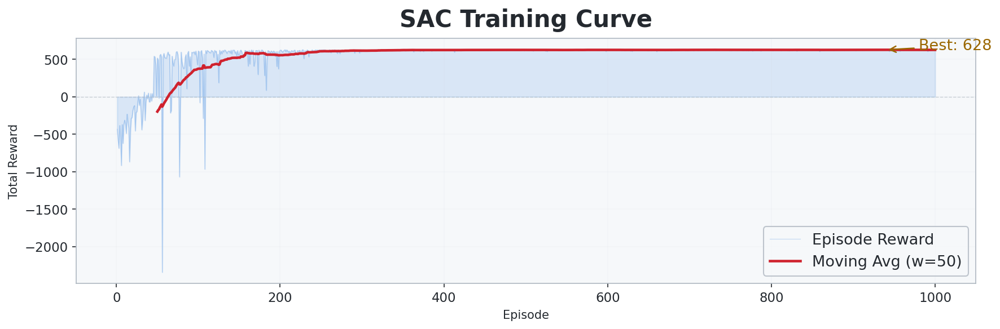

# DRL-based UAV Optimization

DRL 기반 UAV 경로 최적화 실험 모음입니다. UAV가 제한된 에너지 안에서 장애물을 회피하며 여러 waypoint를 방문하도록 학습시키고, 알고리즘을 `TQL -> DQN -> DDQN -> DDPG -> PPO -> SAC` 순서로 확장해 비교합니다.

각 실험 폴더는 독립적으로 실행할 수 있으며, 2D/3D 환경, 이산/연속 행동 공간, 학습 로그, 결과 시각화를 함께 제공합니다.

## 프로젝트 구성

| 폴더 | 알고리즘 | 환경 | 행동 공간 | 맵 크기 | 상세 문서 |
| --- | --- | --- | --- | --- | --- |
| `1_TQL` | Tabular Q-Learning | 2D | Discrete | `10x10` | [README](1_TQL/README.md) |
| `2_1_DQN` | DQN | 2D | Discrete | `20x20` | [README](2_1_DQN/README.md) |
| `2_2_DQN_3D` | DQN | 3D | Discrete | `20x20x5` | [README](2_2_DQN_3D/README.md) |
| `3_1_DDQN` | Double DQN | 2D | Discrete | `50x50` | [README](3_1_DDQN/README.md) |
| `3_2_DDQN_3D` | Double DQN | 3D | Discrete | `50x50x8` | [README](3_2_DDQN_3D/README.md) |
| `4_1_DDPG` | DDPG | 2D | Continuous | `100x100` | [README](4_1_DDPG/README.md) |
| `4_2_DDPG_3D` | DDPG | 3D | Continuous | `100x100x10` | [README](4_2_DDPG_3D/README.md) |
| `5_1_PPO` | PPO | 2D | Continuous | `100x100` | [README](5_1_PPO/README.md) |
| `5_2_PPO_3D` | PPO | 3D | Continuous | `100x100x10` | [README](5_2_PPO_3D/README.md) |
| `6_1_SAC` | SAC | 2D | Continuous | `100x100` | [README](6_1_SAC/README.md) |
| `6_2_SAC_3D` | SAC | 3D | Continuous | `100x100x10` | [README](6_2_SAC_3D/README.md) |

## 실험 흐름

- `1_TQL`은 작은 2D grid에서 tabular Q-learning의 기본 동작을 확인합니다.
- `2_1_DQN`과 `2_2_DQN_3D`는 neural network 기반 Q-learning을 2D와 3D로 확장합니다.
- `3_1_DDQN`과 `3_2_DDQN_3D`는 overestimation을 줄이기 위해 Double DQN 구조를 사용합니다.
- `4_1_DDPG`와 `4_2_DDPG_3D`는 연속 제어 행동을 위해 actor-critic 기반 DDPG를 사용합니다.
- `5_1_PPO`와 `5_2_PPO_3D`는 on-policy stochastic policy 최적화를 적용합니다.
- `6_1_SAC`와 `6_2_SAC_3D`는 entropy-regularized off-policy 학습으로 연속 제어 환경을 다룹니다.

## 폴더 구조

각 알고리즘 폴더는 대체로 다음 구조를 따릅니다.

```text
<algorithm>/
  env/
    config.py       # grid size, waypoint, obstacle, reward 설정
    uav_env.py      # UAV 환경 dynamics와 reward 계산
  *_agent.py        # 알고리즘별 agent/network 구현
  train.py          # 학습 실행 및 training_log 저장
  test.py           # 저장된 모델 평가
  visualize.py      # training curve, best path, flight GIF 생성
  results/          # 모델, 로그, 이미지 결과물
  README.md         # 해당 실험의 상세 설명
```

## 실행 방법

PowerShell에서 저장소 루트 기준으로 실행합니다.

```powershell
cd .\<folder>
..\venv\Scripts\python.exe .\train.py
```

학습된 모델 평가와 결과 시각화는 같은 폴더에서 실행합니다.

```powershell
cd .\<folder>
..\venv\Scripts\python.exe .\test.py
```

예시:

```powershell
cd .\6_2_SAC_3D
..\venv\Scripts\python.exe .\train.py
..\venv\Scripts\python.exe .\test.py
```

## 핵심 결과 갤러리

각 행은 학습 reward curve와 최적 경로 시각화를 함께 보여줍니다. 세부 loss curve, entropy/alpha curve, flight GIF는 아래 산출물 표나 각 폴더 README에서 확인할 수 있습니다.

### Training Curves

| 실험 | Training Curve |
| --- | --- |
| `1_TQL` |  |
| `2_1_DQN` |  |
| `2_2_DQN_3D` |  |
| `3_1_DDQN` |  |
| `3_2_DDQN_3D` |  |
| `4_1_DDPG` |  |
| `4_2_DDPG_3D` |  |
| `5_1_PPO` |  |
| `5_2_PPO_3D` |  |
| `6_1_SAC` |  |
| `6_2_SAC_3D` |  |

### Best Path + Flight GIF

| 실험 | Best Path | Flight GIF |
| --- | --- | --- |
| `1_TQL` |  |  |
| `2_1_DQN` |  |  |
| `2_2_DQN_3D` |  |  |
| `3_1_DDQN` |  |  |
| `3_2_DDQN_3D` |  |  |
| `4_1_DDPG` |  |  |
| `4_2_DDPG_3D` |  |  |
| `5_1_PPO` |  |  |
| `5_2_PPO_3D` |  |  |
| `6_1_SAC` |  |  |
| `6_2_SAC_3D` |  |  |

## 결과 산출물

| 실험 | 주요 모델 | 로그 | 추가 시각화 |
| --- | --- | --- | --- |
| `1_TQL` | [tql_model.pkl](1_TQL/results/tql_model.pkl) | - | [flight.gif](1_TQL/results/flight.gif), [qvalue_heatmap_wp0.png](1_TQL/results/qvalue_heatmap_wp0.png), [qvalue_heatmap_wp1.png](1_TQL/results/qvalue_heatmap_wp1.png) |
| `2_1_DQN` | [dqn_model.pt](2_1_DQN/results/dqn_model.pt) | [training_log.csv](2_1_DQN/results/training_log.csv) | [success_curve.png](2_1_DQN/results/success_curve.png), [loss_curve.png](2_1_DQN/results/loss_curve.png), [flight.gif](2_1_DQN/results/flight.gif) |
| `2_2_DQN_3D` | [dqn_3d_model.pt](2_2_DQN_3D/results/dqn_3d_model.pt) | [training_log.csv](2_2_DQN_3D/results/training_log.csv) | [success_curve.png](2_2_DQN_3D/results/success_curve.png), [loss_curve.png](2_2_DQN_3D/results/loss_curve.png), [flight_3d.gif](2_2_DQN_3D/results/flight_3d.gif) |
| `3_1_DDQN` | [ddqn_model.pt](3_1_DDQN/results/ddqn_model.pt) | [training_log.csv](3_1_DDQN/results/training_log.csv) | [success_curve.png](3_1_DDQN/results/success_curve.png), [loss_curve.png](3_1_DDQN/results/loss_curve.png), [flight.gif](3_1_DDQN/results/flight.gif) |
| `3_2_DDQN_3D` | [ddqn_3d_model.pt](3_2_DDQN_3D/results/ddqn_3d_model.pt), [ddqn_3d_best_model.pt](3_2_DDQN_3D/results/ddqn_3d_best_model.pt) | [training_log.csv](3_2_DDQN_3D/results/training_log.csv) | [success_curve.png](3_2_DDQN_3D/results/success_curve.png), [loss_curve.png](3_2_DDQN_3D/results/loss_curve.png), [flight_3d.gif](3_2_DDQN_3D/results/flight_3d.gif) |
| `4_1_DDPG` | [ddpg_model.pt](4_1_DDPG/results/ddpg_model.pt) | [training_log.csv](4_1_DDPG/results/training_log.csv) | [success_curve.png](4_1_DDPG/results/success_curve.png), [actor_loss.png](4_1_DDPG/results/actor_loss.png), [critic_loss.png](4_1_DDPG/results/critic_loss.png), [flight.gif](4_1_DDPG/results/flight.gif) |
| `4_2_DDPG_3D` | [ddpg_3d_model.pt](4_2_DDPG_3D/results/ddpg_3d_model.pt) | [training_log.csv](4_2_DDPG_3D/results/training_log.csv) | [success_curve.png](4_2_DDPG_3D/results/success_curve.png), [actor_loss.png](4_2_DDPG_3D/results/actor_loss.png), [critic_loss.png](4_2_DDPG_3D/results/critic_loss.png), [flight_3d.gif](4_2_DDPG_3D/results/flight_3d.gif) |
| `5_1_PPO` | [ppo_model.pt](5_1_PPO/results/ppo_model.pt) | [training_log.csv](5_1_PPO/results/training_log.csv) | [success_curve.png](5_1_PPO/results/success_curve.png), [policy_loss.png](5_1_PPO/results/policy_loss.png), [value_loss.png](5_1_PPO/results/value_loss.png), [entropy.png](5_1_PPO/results/entropy.png), [flight.gif](5_1_PPO/results/flight.gif) |
| `5_2_PPO_3D` | [ppo_3d_model.pt](5_2_PPO_3D/results/ppo_3d_model.pt), [ppo_3d_best_model.pt](5_2_PPO_3D/results/ppo_3d_best_model.pt) | [training_log.csv](5_2_PPO_3D/results/training_log.csv) | [success_curve.png](5_2_PPO_3D/results/success_curve.png), [policy_loss.png](5_2_PPO_3D/results/policy_loss.png), [value_loss.png](5_2_PPO_3D/results/value_loss.png), [entropy.png](5_2_PPO_3D/results/entropy.png), [flight_3d.gif](5_2_PPO_3D/results/flight_3d.gif) |
| `6_1_SAC` | [sac_model.pt](6_1_SAC/results/sac_model.pt), [sac_best_model.pt](6_1_SAC/results/sac_best_model.pt) | [training_log.csv](6_1_SAC/results/training_log.csv) | [success_curve.png](6_1_SAC/results/success_curve.png), [actor_loss.png](6_1_SAC/results/actor_loss.png), [critic_loss.png](6_1_SAC/results/critic_loss.png), [alpha_curve.png](6_1_SAC/results/alpha_curve.png), [flight.gif](6_1_SAC/results/flight.gif) |
| `6_2_SAC_3D` | [sac_3d_model.pt](6_2_SAC_3D/results/sac_3d_model.pt), [sac_3d_best_model.pt](6_2_SAC_3D/results/sac_3d_best_model.pt) | [training_log.csv](6_2_SAC_3D/results/training_log.csv) | [success_curve.png](6_2_SAC_3D/results/success_curve.png), [actor_loss.png](6_2_SAC_3D/results/actor_loss.png), [critic_loss.png](6_2_SAC_3D/results/critic_loss.png), [alpha_curve.png](6_2_SAC_3D/results/alpha_curve.png), [flight_3d.gif](6_2_SAC_3D/results/flight_3d.gif) |
