# DRL-based UAV Optimization

DRL 기반 UAV 경로 최적화 실험 모음입니다. UAV가 제한된 에너지 안에서 장애물을 회피하며 여러 waypoint를 방문하도록 학습시키고, 알고리즘을 `TQL -> DQN -> DDQN -> DDPG -> PPO -> SAC` 순서로 확장해 비교합니다.

각 실험 폴더는 독립적으로 실행할 수 있으며, 2D/3D 환경, 이산/연속 행동 공간, 학습 로그, 결과 시각화를 함께 제공합니다.

## 프로젝트 구성

| 폴더 | 알고리즘 | 환경 | 행동 공간 | 맵 크기 | 상세 문서 |
| --- | --- | --- | --- | --- | --- |
| `1_TQL` | Tabular Q-Learning | 2D | Discrete | `10x10` | [README](1_TQL/README.md) |
| `2_1_DQN` | DQN | 2D | Discrete | `20x20` | [README](2_1_DQN/README.md) |
| `2_2_DQN_3D` | DQN | 3D | Discrete | `20x20x5` | [README](2_2_DQN_3D/README.md) |
| `3_1_DDQN` | Double DQN | 2D | Discrete | `50x50` | [README](3_1_DDQN/README.md) |
| `3_2_DDQN_3D` | Double DQN | 3D | Discrete | `50x50x8` | [README](3_2_DDQN_3D/README.md) |
| `4_1_DDPG` | DDPG | 2D | Continuous | `100x100` | [README](4_1_DDPG/README.md) |
| `4_2_DDPG_3D` | DDPG | 3D | Continuous | `100x100x10` | [README](4_2_DDPG_3D/README.md) |
| `5_1_PPO` | PPO | 2D | Continuous | `100x100` | [README](5_1_PPO/README.md) |
| `5_2_PPO_3D` | PPO | 3D | Continuous | `100x100x10` | [README](5_2_PPO_3D/README.md) |
| `6_1_SAC` | SAC | 2D | Continuous | `100x100` | [README](6_1_SAC/README.md) |
| `6_2_SAC_3D` | SAC | 3D | Continuous | `100x100x10` | [README](6_2_SAC_3D/README.md) |

## 폴더 구조

각 알고리즘 폴더는 대체로 다음 구조를 따릅니다.

```text
<algorithm>/
  env/
    config.py       # grid size, waypoint, obstacle, reward 설정
    uav_env.py      # UAV 환경 dynamics와 reward 계산
  *_agent.py        # 알고리즘별 agent/network 구현
  train.py          # 학습 실행 및 training_log 저장
  test.py           # 저장된 모델 평가
  visualize.py      # training curve, best path, flight GIF 생성
  results/          # 모델, 로그, 이미지 결과물
  README.md         # 해당 실험의 상세 설명
```

## 실행 방법

PowerShell에서 저장소 루트 기준으로 실행합니다.

```powershell
cd .\<folder>
..\venv\Scripts\python.exe .\train.py
```

학습된 모델 평가와 결과 시각화는 같은 폴더에서 실행합니다.

```powershell
cd .\<folder>
..\venv\Scripts\python.exe .\test.py
```

예시:

```powershell
cd .\6_2_SAC_3D
..\venv\Scripts\python.exe .\train.py
..\venv\Scripts\python.exe .\test.py
```

11개 폴더의 결과 이미지를 한 번에 다시 만들고 싶다면 루트의 일괄 스크립트를 사용합니다.

```powershell
.\regenerate_results.ps1                       # 전체 11개 폴더 test.py 실행
.\regenerate_results.ps1 -Only 1_TQL,2_1_DQN   # 특정 폴더만
```

## 실험 결과

### Best Path + Flight GIF

모든 결과 이미지는 통일된 16:9 비율 (figsize 16×9, PNG dpi=140 / GIF dpi=100) 으로 생성되며,
README 미리보기 폭(`width="380"`)도 두 칼럼이 동일하게 정렬되도록 맞췄습니다.

| 실험 | Best Path | Flight GIF |
| --- | --- | --- |
| `1_TQL` | 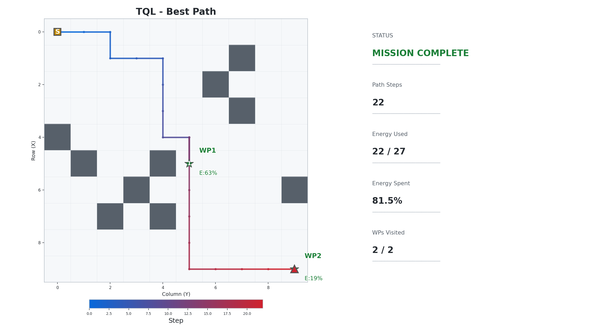 | 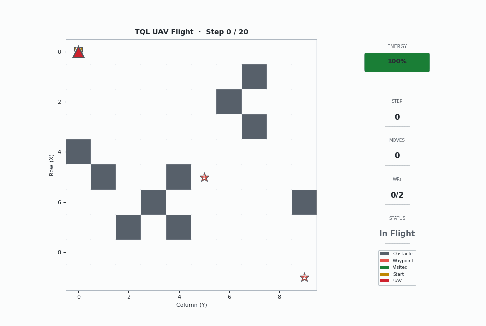 |
| `2_1_DQN` | 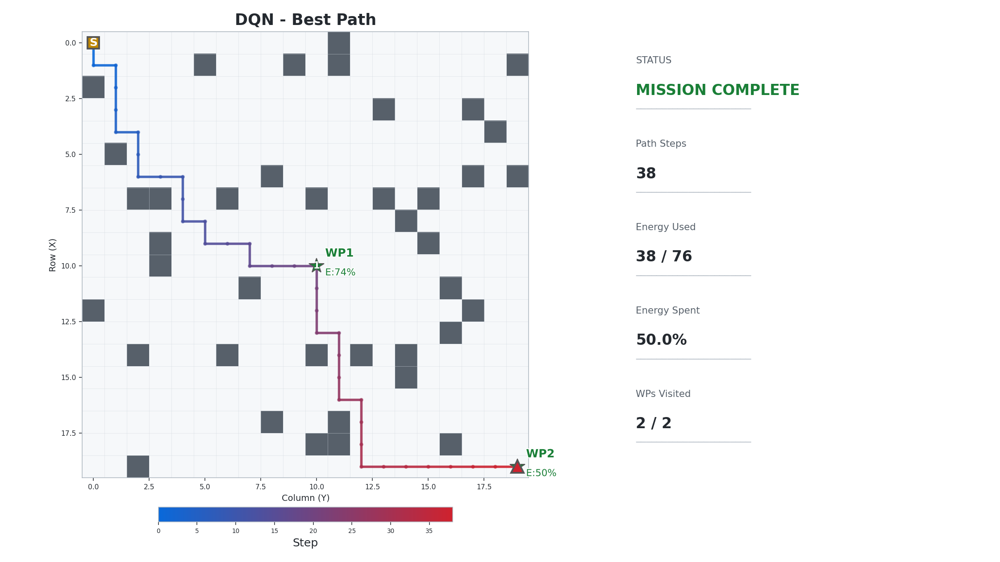 | 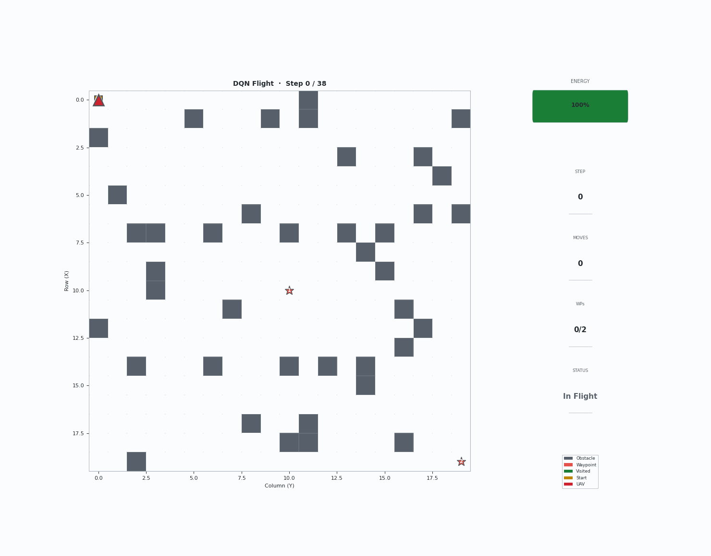 |
| `2_2_DQN_3D` | 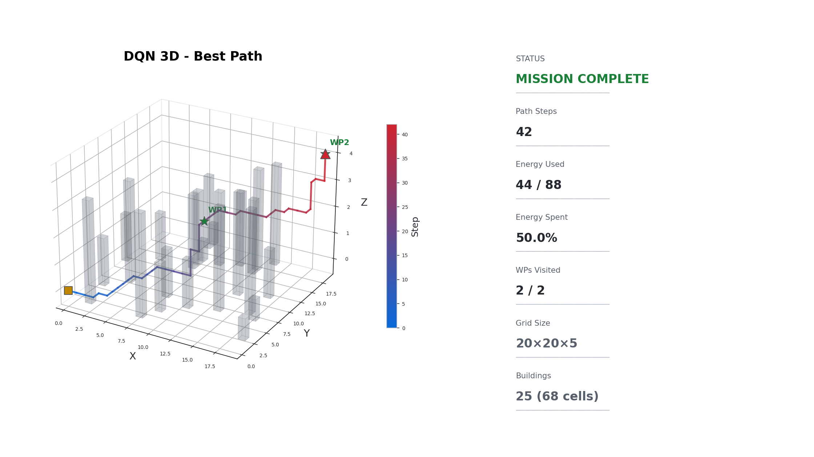 | 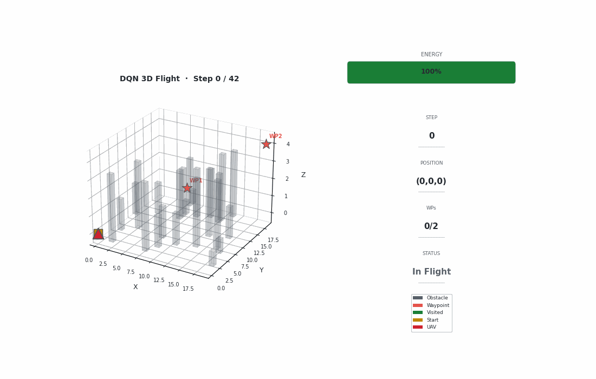 |
| `3_1_DDQN` | 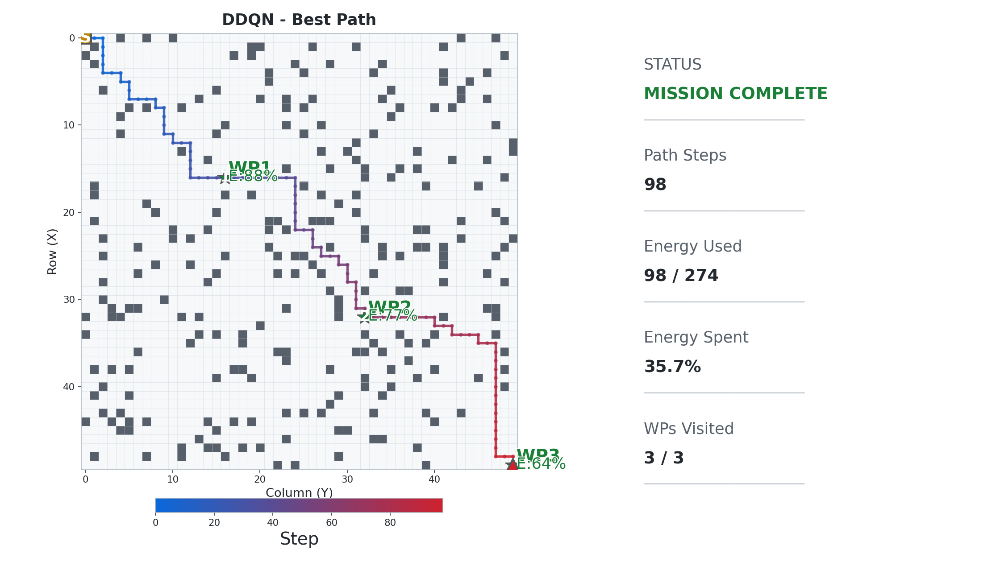 | 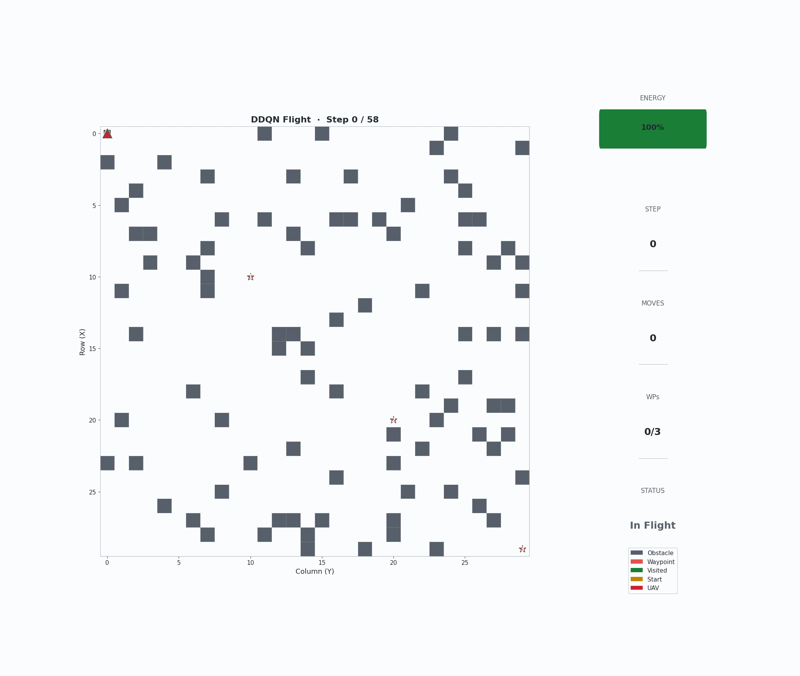 |
| `3_2_DDQN_3D` | 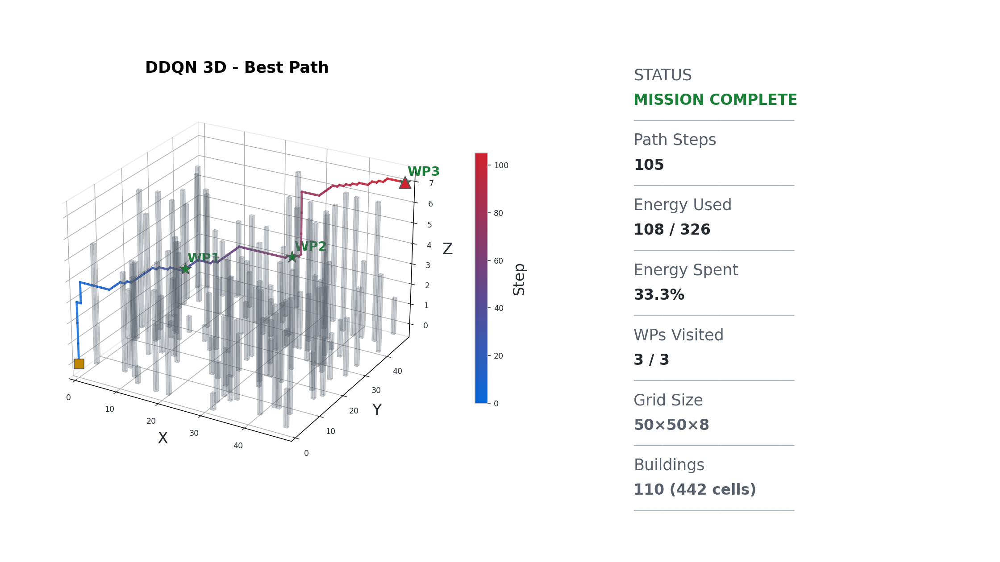 | 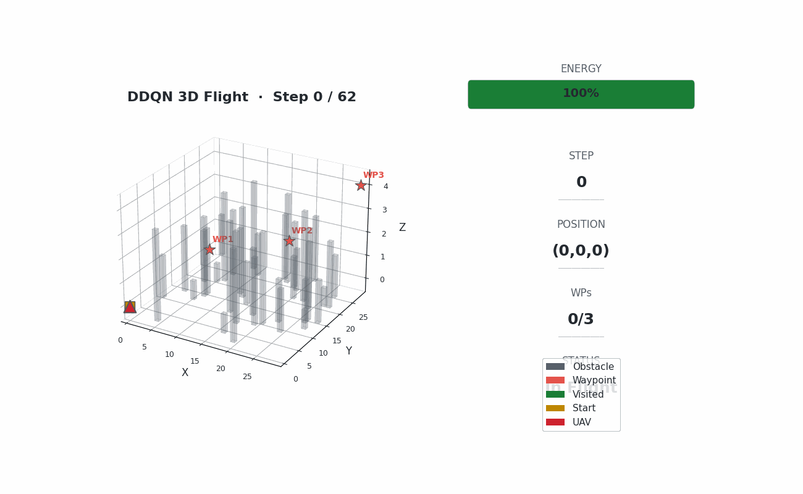 |
| `4_1_DDPG` | 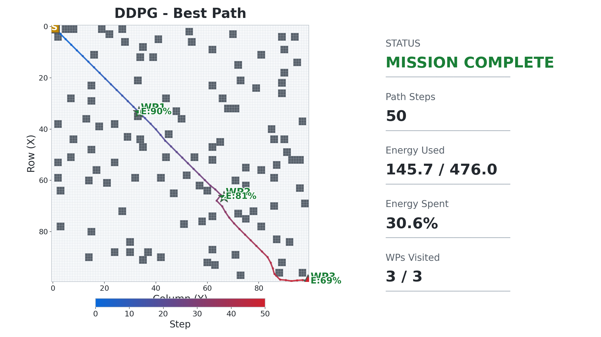 | 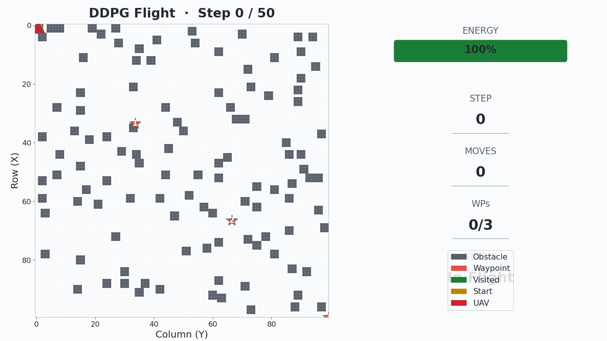 |
| `4_2_DDPG_3D` | 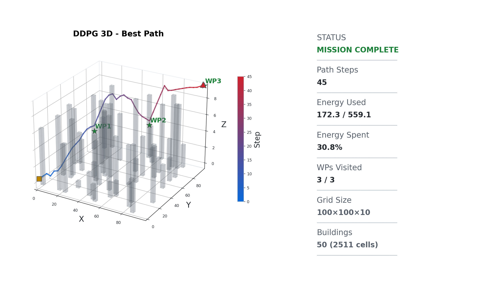 | 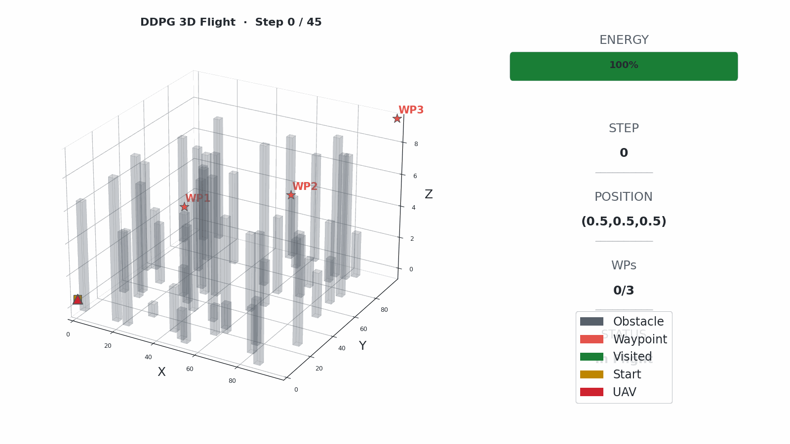 |
| `5_1_PPO` |  |  |
| `5_2_PPO_3D` | 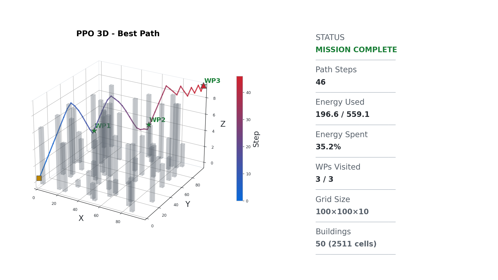 |  |
| `6_1_SAC` | 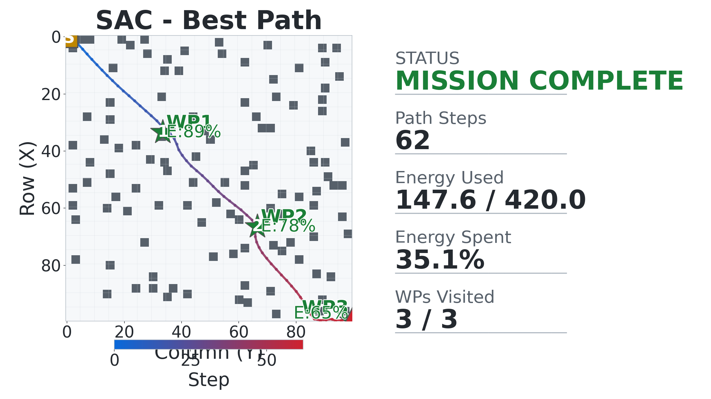 |  |
| `6_2_SAC_3D` |  |  |
